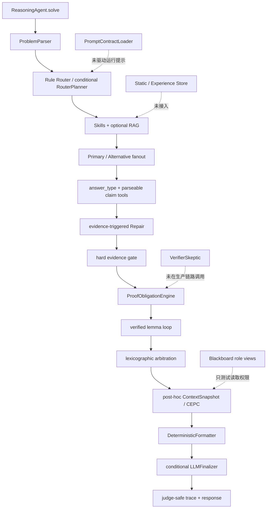

# Math-Agent 深度实施审查报告

> 审查日期：2026-07-22  
> 审查对象：`Math-Agent-Codex-Dev`  
> 审查基线：`b74fc31 fix: connect verified roles to the runtime pipeline`  
> 对照文档：`Math-Agent_Codex工程实施计划.md`（P00–P13）  
> 审查性质：代码、测试、运行期连线和反例验证；未使用正式隐藏赛题，也未调用在线模型。

## 1. 结论摘要

当前项目已经是一个**可导入、可并发运行、具备完整模块轮廓的数学推理 Harness 原型**，但还不能认定为实施计划所定义的“competition-grade 完成版”，也不应直接把 `config/competition.json` 视为经过证据冻结的榜单配置。

综合结论如下：

| 维度 | 结论 | 评价 |
|---|---|---|
| 官方接口与不可修改文件 | 满足 | `ReasoningAgent`、返回契约、`main.py`/`llm_client.py` 完整性均通过 |
| 基本线程隔离 | 基本满足 | 每题 Session 独立，共享对象大多只读，模型并发有信号量 |
| 模型访问边界 | 满足 | 生产路径只经注入的 `client.chat(...)` |
| 多智能体骨架 | 已建立 | Router、Primary、Alternative、Repair、Finalizer 有真实模型调用路径 |
| 多智能体闭环 | 部分满足 | VerifierSkeptic 未进入生产链路；LemmaCurator 是确定性抽取器；Prompt Contract 未驱动角色 |
| 硬证据与证明义务 | 部分满足 | 有数据结构和仲裁，但 required 义务未形成最终硬门控 |
| Memory/CEPC | 组件存在，主链路不完整 | 压缩发生在仲裁之后，未实际组装各 Agent 输入，且字符上限可被突破 |
| Deadline/预算 | 调用与估算 Token 有效，时间不完整 | 软截止未使用，正在执行的模型调用不能被硬截止终止 |
| RAG/MCP | 可运行但需整改 | RAG 排序、连接释放和知识审核存在问题；MCP 可选且默认关闭 |
| Benchmark/消融 | 未完成证据闭环 | 指标实现有误判，尚无真实 A0–A9 结果，不能称为“evidence-based freeze” |
| 是否符合赛题形式要求 | 基本符合 | 可提交接口、安全边界和离线运行方向正确 |
| 是否达到计划定义的最终完成状态 | 不符合 | 数学正确性门控、角色闭环、截止控制和真实消融仍缺失 |

**最终判定：项目适合作为第二阶段工程基线，不适合作为最终榜单冻结版本。**

## 2. 审查方法与已验证事实

### 2.1 已执行检查

- 阅读并映射 P00–P13 计划条目、目录、提交和测试。
- 复核运行入口、共享状态、模型调用边界、Trace 和 fallback。
- 静态搜索生产代码中各角色和服务的调用点。
- 运行全量测试、基线校验和提交校验。
- 构造 claimless proof、超时调用、重复候选、CEPC 超长输入、局部 Repair、RAG 排序和 Benchmark 误判反例。

### 2.2 当前通过项

```text
python -m compileall .              PASS
pytest -q                           70 passed
python scripts/verify_baseline_files.py
                                     PASS
python scripts/validate_submission.py
                                     PASS
```

这些结果证明基本工程契约有效，但不能证明数学正确性闭环和榜单性能已经完成。

## 3. 当前实际运行流程

生产主链路位于 `mathforge/runtime.py`，实际流程是：



关键区别是：多个计划组件已经存在于代码库，但“存在”不等于“参与生产决策”。

## 4. 阻断级问题

### B-01：required 证明义务没有最终硬门控

**证据**

- `mathforge/verification/proof_obligations.py:24-66` 能生成并标记义务。
- `mathforge/verification/arbitration.py:88-96` 只把覆盖率作为排序字段。
- `mathforge/runtime.py:234-304` 在生成义务后直接进入引理循环和仲裁，没有“required 全部完成，否则候选不可完成”的判定。
- `VerifierSkeptic` 定义于 `mathforge/agents/verifier.py:16`，但生产代码没有实例化或调用。

**反例结果**

输入 `Prove that the equation has a unique solution`，模型只返回 `Assertion only / QED` 且没有 Claim。系统生成四个 unresolved required 义务：definition、sufficiency、uniqueness、boundary，但仍返回：

```text
Assertion only.

Final answer: QED
```

没有进入 fallback，也没有标记证明不完整。

**影响**

这直接违反计划验收条件“required 义务失败的证明不得标记完成”。对证明题而言，这是当前最严重的正确性漏洞。

**解决方案**

1. 增加 `ProofCompletionGate`，将 required obligation 分为 `satisfied / failed / unknown`。
2. 证明题只有 required 全部 `satisfied` 才能进入 Finalizer。
3. `failed` 触发 Claim Repair；`unknown` 触发一次 VerifierSkeptic 或补充证据。
4. 所有候选仍不完整时，返回明确的“不完整证明”fallback，不得输出 QED 风格完成答案。
5. Finalizer 输入必须包含已满足义务集合，不只包含 `solution_text`。

**验收测试**

- claimless proof 不得作为完成答案返回。
- 两个同样遗漏 uniqueness 的候选不能因答案一致获胜。
- Finalizer 无法看到或完成未满足义务时必须回退。

### B-02：时间预算不是可执行的硬截止

**证据**

- `mathforge/harness/budget.py:27-49` 只在新模型调用开始前检查时间。
- `soft_expired()` 和 `must_finalize()` 只在测试中使用。
- 生产代码仅在 `mathforge/runtime.py:107` 调用一次 `can_start_exploration()`。
- `mathforge/harness/provider.py:16` 对 `client.chat` 是同步阻塞调用，没有 deadline-aware 等待。
- fanout 使用 `ThreadPoolExecutor` 上下文，退出时会等待已运行分支结束。

**反例结果**

配置 hard deadline 为 `0.01 s`，客户端睡眠 `0.06 s`。实际 `solve()` 用时约 `0.067 s`，仍成功返回且没有 deadline fallback。

**影响**

计划中的 12/13/14–15 分钟策略并未真正成立；网络重试或慢分支可能跨越内部硬截止。`P95` 也没有真实测量证明。

**解决方案**

1. 建立单一 `DeadlineController.remaining_seconds()`，Router、fanout、Repair、lemma expansion、Finalizer 每次开始前都检查。
2. 为各阶段预留 finalize 安全窗口，不允许在剩余时间不足时启动新角色。
3. fanout 改为 deadline-aware `wait`，到期只收集已完成候选，禁止上下文管理器继续阻塞等待。
4. 模型接口不能传 timeout，因此必须根据官方客户端最坏重试时间设置“禁止启动阈值”；同时记录未完成后台调用风险。
5. 加入真实慢客户端集成测试和 P50/P95 压测。

### B-03：VerifierSkeptic 和 Prompt Contract 没有进入生产闭环

**证据**

- `PromptContractLoader` 只定义于 `mathforge/agents/registry.py:109`，仅测试调用。
- 角色提示仍硬编码在 `router_planner.py`、`solver.py`、`repair.py`、`finalizer.py`。
- `VerifierSkeptic` 只有类定义和单元逻辑，没有生产调用点。
- LemmaCurator 是 `CandidateSolution.claims` 的确定性转换器，不是计划定义的条件 LLM 角色。

**影响**

- Prompt Contract 无法约束真实角色的输入可见性、工具白名单、失败策略和版本。
- 中高风险路径缺少独立 Skeptic；大多数 reasoning Claim 永远是 `unverified`。
- “固定 LLM 角色”实际只完整实现了 Router、Primary、Alternative、Repair、Finalizer。

**解决方案**

1. 所有角色必须通过 `PromptContractLoader` 构造提示，删除重复硬编码契约。
2. 中高风险候选进入 `VerifierSkepticAgent`；其输出只能产生 soft/unknown 结论，hard 结论仍需工具或确定性规则。
3. 高风险 LemmaCurator 可调用模型提取卡片，但初始状态只能是 provisional。
4. 为每个角色增加生产链路集成测试，断言 forbidden context 确实不在 messages 中。

### B-04：CEPC 没有作为 Agent 输入层，且大小上限不成立

**证据**

- `ContextAssembler` 只在仲裁选出候选之后由 `runtime.py:307-329` 调用。
- Alternative 和 Repair 的隔离由各自手写 prompt 实现，不是 CEPC view。
- `MemoryBlackboard.view()` 仅测试使用；生产链路只 publish，不读取。
- `ContextCompressor._trim_soft_content()` 只删 soft evidence 和 `solution_text`，删完不重新检查大小。
- `RawContextStore` 截断文本，但 `ContextSnapshot.original_problem` 又保存完整 `problem.raw_problem`。

**反例结果**

请求 `max_chars=100` 时，压缩结果序列化后仍为 `5351` 字符。

**影响**

P07 的核心目标“各 Agent 获得不同 View、上下文有硬上限、压缩保护不变量”只在组件测试层成立，未成为统一生产机制。长题可能突破上下文预算。

**解决方案**

1. 将 ContextAssembler 前移到每个角色调用之前。
2. Router、Primary、Alternative、Verifier、Repair、LemmaCurator、Finalizer 全部只能接收 `RoleContextView`。
3. 原题使用一次受控原文块加稳定引用；对超长原题定义不可压缩保留预算，而不是同时保留截断版和完整版。
4. 压缩后必须重新计算字符数；若硬不变量本身超过预算，应返回显式 `context_budget_infeasible`，而不是静默超限。
5. 删除或接入当前未使用的 Blackboard read path 和 Static/Experience Store，避免“架构占位”。

### B-05：P13 尚未完成，Benchmark 指标会产生错误结论

**证据**

- `mathforge/benchmark.py:148` 使用 `actual.endswith(expected)` 判定正确。
- 没有真实 benchmark 输出或 A0–A9 结果文件。
- `config/competition.json` 默认开启全部模块，不是根据稳定增益选择。
- 平均调用次数只统计 `primary_completed`，fallback 样本可能被排除，成本会被低估。
- concurrency pollution 只统计重复 session ID，不能检测答案或上下文串题。

**反例结果**

期望答案为 `2`、实际答案为 `42` 时，Benchmark 报告准确率 `1.0`。

**影响**

任何基于当前 runner 的模块保留/删除结论都不可靠，因此 `perf: freeze evidence-based competition configuration` 的名称超出了现有证据。

**解决方案**

1. 按答案类型实现 scorer：整数/分数精确、表达式符号等价、集合/区间结构等价、矩阵逐项等价、选择题严格匹配、证明题人工或 rubric scorer。
2. 禁止 suffix/substring 作为最终正确性判定。
3. 所有样本都记录调用、Token、延迟和 fallback；失败样本成本不得丢失。
4. 并发污染使用题目 nonce、prompt capture 和输出归属检查。
5. 运行真实 A0–A9，多次重复并给出置信区间；没有稳定增益的模块默认关闭。

## 5. 高优先级问题

### H-01：方法正交性没有被真正执行，重复候选仍增加“一致性”

**证据**

- fanout 在调用前虚构 `standard-{subject}` 作为 Primary 方法标签，而不是读取 Primary 的实际方法。
- Alternative 分支之间提示差异很小。
- 重复检测只给 `parse_status` 加 `duplicate_method`；仲裁不读取该字段。
- `ArbitrationPolicy` 的 independent agreement 等于答案 cluster 大小减一。

**反例结果**

两个相同方法、相同答案的候选，即使 Alternative 已标记 `duplicate_method`，两者的 `independent_agreement` 仍都是 `1`。

**整改**

- Router/方法规划器先生成互斥 method families，再并发执行。
- duplicate candidate 从独立一致性计数中移除或降权为零。
- agreement 必须同时满足答案等价、role 独立、method signature 不同。

### H-02：Repair 可以在失败 Claim 未被重新验证时被接受

**证据**

- Repair 只要求 `new_evidence` 非空并比较聚合质量。
- 没有检查每一个 originally failed claim 是否获得新的 pass/unknown/fail 记录。
- 合并候选保留原 `solution_text`，但允许改变 `final_answer` 和局部 Claim。

**反例结果**

失败 Claim 为 `failed`，Repair 后只重新验证其依赖 `base`，服务仍返回 `accepted`；`failed` 本身没有新证据。

**影响**

系统可能接受没有修复目标证据的版本，并输出与旧推导不一致的新答案。

**整改**

- 每个 originally failed claim 必须有新版本证据；缺一即回滚。
- 对 changed claim 的依赖闭包和下游影响闭包都要重验。
- 接受 Repair 后重新生成一致的 solution exposition，或用结构化 Claim 图确定性重建，不得直接复用旧 `solution_text`。

### H-03：符号硬证据没有携带定义域和假设

**证据**

- ClaimEvidenceVerifier 只从自由文本等号两侧构造参数。
- `symbolic_equivalence` 不接收 Candidate assumptions/domains。
- EvidenceRecord 只保存工具输出 payload，没有保存输入表达式、假设、工具版本和输入摘要。

**影响**

例如 `sqrt(x^2)=x` 在 `x>=0` 下和全实数上的结论不同。当前工具可能把缺失假设后的反例当作 hard fail，也无法完整复现实验。

**整改**

- 工具请求引入 `ToolInvocation`：arguments、domains、assumptions、tool_version、timeout、input_digest。
- 无法可靠解析假设时只能返回 unknown/medium，不能 hard fail。
- LaTeX Claim 先经过受限规范化器，不直接按字符串 `=` 切分。

### H-04：RAG 排序实现与设计描述不一致，并存在连接释放问题

**证据**

- SQL 先计算 BM25，但随后 `cards.sort(...)` 仅按条件重合和 card ID 重排，BM25 与 trust rank 被丢弃。
- trust level 使用字符串排序，未定义 `verified > reviewed > conflicted` 的显式优先级。
- `with sqlite3.connect(...)` 管理事务但不保证显式关闭连接。
- 种子卡来源是项目内一行 Skill，全部直接标记 `reviewed`，缺少人工审核记录和外部权威来源。

**反例结果**

查询 `equation exactterm` 时，Top-1 返回 ID 更靠前的弱匹配 `a-weak`，而不是 BM25 更相关且 trust 为 verified 的 `z-exact`。Windows 探针还观察到临时数据库句柄未能立即释放。

**整改**

- 返回带 BM25 score 的 `SearchHit`，使用显式复合排序：subject/type filter → trust priority → condition score → BM25 → dedupe。
- 用 `try/finally: connection.close()` 或 `contextlib.closing`。
- 卡片增加 reviewer、review_date、content_hash、权威 source URL/书目版本。

### H-05：路由的辅助领域规则实际不可达，风险估计过浅

**证据**

- 任一关键词命中就得到至少 `0.80`。
- 选择 auxiliary 的前提却是 top score `<0.75`。
- 无关键词时只有 general-math 一个候选，也无法选 auxiliary。
- 风险主要由“是否 proof/derivation”和 top score 决定，没有表达式复杂度、条件数量、定理交换、病态数值等特征。

**反例结果**

`Compute the probability of a random matrix eigenvalue` 同时得到 linear-algebra `0.88` 和 probability `0.88`，辅助领域仍为 `null`。

**整改**

- 分离 subject confidence 与 ambiguity margin；Top-1 高但 Top-2 同分时仍应选择辅助领域。
- 把 `ProblemIR.subject_candidates` 真正填充并传给 RouterPlanner。
- 建立可测试的风险特征表和校准集。

## 6. 中优先级问题

| 编号 | 问题 | 证据/影响 | 建议 |
|---|---|---|---|
| M-01 | StaticKnowledgeStore、ExperienceStore 未接入 | 只有定义，无生产调用 | 接入只读检索或删除，避免假完成 |
| M-02 | Blackboard 只写不读 | `view()` 仅单测使用 | 让所有角色从 Blackboard/ContextView 获取授权字段 |
| M-03 | LLMFinalizer 未接收 evidence/obligations | 只收到 selected solution 和 exact answer | 仅给已验证 Claim、义务摘要和 exact answer |
| M-04 | Lemma 验证独立性不足 | 主要继承源 Claim 状态 | 对 lemma 的 conditions、dependencies、proof sketch 进行独立检查 |
| M-05 | MCP 每次工具调用启动新进程 | 功能正确但延迟高，Schema 属性缺少类型 | 默认保持关闭；若保留，使用长驻进程和完整 JSON Schema |
| M-06 | internal trace 实际丢弃 | TraceBuilder 内部保存，solve 返回后不可诊断 | 本地 debug sink 可选写入，正式评测保持关闭 |
| M-07 | fallback 只返回“无法求解” | 契约满足但竞赛得分为零 | 增加安全的低成本确定性简单题 fallback |
| M-08 | solution JSON 防御不足 | 某些字段类型错误会逐字符转换或触发全局 fallback | 每字段做类型检查和局部降级 |
| M-09 | 工具 Schema 不完整 | MCP `properties` 没有明确 JSON type | 从显式 schema 定义生成，不依赖签名猜测 |
| M-10 | 测试偏组件级 | 缺少结构化中/高风险端到端黄金路径 | 增加角色消息、证据、Repair、lemma、义务、deadline 全流程集成测试 |

## 7. P00–P13 完成度复核

| 阶段 | 状态 | 审查结论 |
|---|---|---|
| P00 基线冻结 | 完成 | 官方文件校验、manifest、snapshot 均存在 |
| P01 最小 Harness | 完成 | 薄入口、Session、Gate、fallback、并发基本契约有效 |
| P02 解析与格式化 | 基本完成 | 六类题型和降级链存在；复杂 LaTeX/选项/字段类型仍需强化 |
| P03 Router + Skills | 部分完成 | 18 Skills 和契约文件存在；辅助路由不可达，契约未驱动运行 |
| P04 正交候选 | 部分完成 | fanout 和隔离有效；方法正交与重复降级不成立 |
| P05 工具 + Evidence | 部分完成 | 九个工具、隔离、超时存在；缺定义域证据和完整 invocation 记录 |
| P06 证明义务 + 仲裁 | 未完成闭环 | 数据结构和排序存在；Verifier 未接入，required 义务不门控 |
| P07 Memory + CEPC | 未完成闭环 | 服务存在；未成为角色输入层，硬字符上限可突破 |
| P08 引理循环 | 部分完成 | high-risk、两轮、progress、verified 注入存在；独立验证能力不足 |
| P09 Claim Repair | 部分完成 | 已接主链路；重验证覆盖和答案/推导一致性有漏洞 |
| P10 离线 RAG | 部分完成 | FTS5 与降级存在；排序、连接、审核来源需修复 |
| P11 StdIO MCP | 基本完成 | Direct/MCP 一致和 fallback 有测试；性能和协议完整度一般 |
| P12 稳定性 | 部分完成 | Trace/调用预算/提交脚本存在；真正 deadline 和 P95 未完成 |
| P13 消融冻结 | 未完成 | runner 有指标错误，缺真实消融结果和基于证据的模块选择 |

## 8. 多智能体实现复核

| 角色 | 是否真实模型调用 | 是否进入生产链路 | 输入隔离 | 结论 |
|---|---:|---:|---|---|
| RouterPlanner | 条件调用 | 是 | 只看原题 | 基本实现，路由校准不足 |
| PrimarySolver | 是 | 是 | 原题、route、skills/RAG | 已实现 |
| AlternativeSolver | 是 | 是 | 未见 Primary 全文 | 已实现，但实际方法正交不足 |
| LemmaCurator | 否，确定性抽取 | 是 | 读取候选 Claim | 不符合“固定 LLM 角色”的完整定义 |
| VerifierSkeptic | 否 | 否 | 仅有类实现 | 关键缺失 |
| RepairAgent | 是 | 是 | 失败 Claim 局部闭包 | 已接入，但重验证门槛有漏洞 |
| LLMFinalizer | 是 | 是 | 只看选中解和精确答案 | 答案不变式有效，但缺 evidence/obligations |

因此，当前系统是“**多角色 LLM + 多个确定性服务**”，但还不是计划所述的完整固定角色多智能体闭环。

## 9. Harness 完整性判断

### 9.1 已满足

- 每次 `solve()` 创建新的 Session。
- 题内 Candidate、Evidence、Round、Memory 不存入 Harness 共享字段。
- Registry、Skills、Retriever 配置在运行期按只读方式使用。
- 模型调用经 `BoundedSemaphore` 限流。
- 返回始终是 `final_response: str` 和 `trace: list`。
- 生产 Trace 不包含完整失败候选或本地绝对路径。
- `main.py`、`llm_client.py` 未修改。
- 没有新建外部模型客户端或读取额外 API key。
- RAG 正式运行不访问网络，MCP 默认关闭。

### 9.2 尚未满足

- required 证明义务的硬完成条件。
- VerifierSkeptic 生产角色。
- Prompt Contract 对真实 messages 的统一约束。
- CEPC 作为所有角色的上下文入口。
- 真正可执行的软/硬截止。
- 方法独立性和重复候选降级。
- 可复现、定义域感知的 Claim 级硬证据。
- 真实 benchmark 和消融支持的 competition freeze。

## 10. 赛题合规性判断

### 10.1 形式与安全合规：基本通过

- 官方 runner 可导入 `ReasoningAgent`。
- 同一 Agent 实例并发调用的基本隔离测试通过。
- 只使用官方注入客户端的公开 `chat` 接口。
- 无隐藏答案读取、无第二在线模型、无生产期在线 RAG。
- 输出可 JSON 序列化且 fallback 非空。

### 10.2 可靠性与竞争力合规：未通过最终门槛

- 证明不完整仍可能作为完成答案返回。
- 内部 hard deadline 不能保证。
- 多智能体中最关键的 Skeptic 验证没有运行。
- CEPC、Memory 和 Prompt Contract 不是统一运行基础设施。
- 消融 runner 会误判正确率，尚无真实结果。

因此可以说项目**符合参赛代码的基本接口与安全方向**，但不符合实施计划中“进入榜单提交”的完整工程完成定义。

## 11. 建议整改实施计划

### R0：修复评测可信度（1–2 天，先做）

目标：所有后续决策建立在可信指标上。

1. 删除 suffix 正确性判定，按 answer type 实现 scorer。
2. 成本统计覆盖 fallback 和失败样本。
3. 为每道题加入唯一 nonce，检测并发串题。
4. 新增 `benchmark_schema_version`、配置 hash、代码 commit、数据集 hash。
5. 将当前 `competition.json` 标记为 `candidate`，在真实消融前不得称 evidence-based frozen。

验收：`42` 对期望 `2` 必须判错；相同输入重复运行指标可复现。

### R1：建立数学完成硬门（3–5 天）

目标：错误或不完整证明不能被格式化成完成答案。

1. 实现并接入 VerifierSkeptic。
2. 增加 `ProofCompletionGate`。
3. required obligations 未满足时触发验证/Repair，最终仍未满足则淘汰。
4. LLM 验证只能贡献 soft evidence；hard evidence 必须来自工具或确定性证明规则。
5. Finalizer 只接收完成门通过的候选。

验收：claimless proof、缺唯一性证明、缺定理前提三类反例全部被拒绝。

### R2：修复 Evidence 与 Repair（2–4 天）

1. EvidenceRecord 加入 invocation、assumptions、domains、tool version、duration 和 input digest。
2. 符号工具变为定义域感知。
3. Repair 必须逐一覆盖 originally failed claims。
4. 重新验证受影响的上游依赖和下游依赖者。
5. 接受 Repair 后重建一致的完整答案文本。

验收：只验证依赖而不验证失败 Claim 的 Repair 必须回滚。

### R3：真正实现方法正交和角色契约（2–3 天）

1. Router 输出 method families，而不是运行前虚构 Primary method。
2. fanout 每个分支获得互斥方法合同。
3. duplicate candidate 不计 independent agreement。
4. PromptContractLoader 成为唯一角色 prompt 入口。
5. 静态测试 messages 中的 visible/forbidden context。

验收：两个同方法同答案候选的 independent agreement 为零。

### R4：把 CEPC/Memory 前移到运行主链路（3–4 天）

1. 每个角色调用前构造 ContextSnapshot 和 RoleContextView。
2. Blackboard view 成为授权入口。
3. 对所有 view 强制字符预算和不变量检查。
4. Static/Experience Store 要么接入，要么删除。
5. 压缩不可行时显式降级工作流，不静默超限。

验收：任意角色 messages 大小不超预算；Alternative 永远看不到 Primary 推导；Repair 只看到局部闭包。

### R5：完成 Deadline 和并发稳定性（2–3 天）

1. 所有阶段共享 DeadlineController。
2. fanout 到期不等待未完成分支。
3. soft cutoff 降级候选数、RAG、lemma、Repair 和 Finalizer。
4. 预留 deterministic finalize 时间。
5. 运行 8 题并发慢客户端测试和 P95 压测。

验收：配置 100 ms hard deadline 时 `solve()` 在容差内返回；无跨题后台写入。

### R6：修复 RAG 与可选组件（1–2 天）

1. 保留 BM25 score 并显式组合 trust/condition rank。
2. 显式关闭 SQLite 连接。
3. 建立人工审核清单和来源版本。
4. MCP 保持默认关闭，只有消融有收益才保留。

验收：精确高可信卡优先于 ID 靠前的弱匹配卡；Windows 下数据库可立即移动/删除。

### R7：真实消融与最终冻结（取决于数据集和模型额度）

1. 准备分领域、分题型、分风险的验证集。
2. 运行 A0–A9，至少三次重复。
3. 报告置信区间、成本、P95、fallback、lemma/repair/CEPC 指标。
4. 遵守计划规则：无稳定正确率增益且显著增加成本的模块删除或默认关闭。
5. 再生成真正的 `competition.json` 和冻结报告。

## 12. 修复优先级

```text
R0 可信 Benchmark
→ R1 证明完成硬门 + Verifier
→ R2 Evidence/Repair
→ R3 正交方法 + Prompt Contract
→ R4 CEPC/Memory 主链路
→ R5 Deadline/并发
→ R6 RAG/MCP
→ R7 真实消融冻结
```

不要先扩充更多 Skills、知识卡或工具数量。当前瓶颈不是组件数量，而是已有组件没有形成可靠的数学正确性和运行时门控闭环。

## 13. 最终 Definition of Done

只有同时满足以下条件，才建议称为完成实施计划：

- [ ] claimless/incomplete proof 无法通过完成门。
- [ ] VerifierSkeptic 在中高风险生产链路真实运行。
- [ ] 所有角色由 Prompt Contract 和 RoleContextView 驱动。
- [ ] duplicate method 不贡献 independent agreement。
- [ ] hard evidence 可复现且包含定义域/假设。
- [ ] Repair 逐一重验所有失败 Claim，并保持答案与推导一致。
- [ ] CEPC 对每个角色强制预算且不变量通过。
- [ ] hard deadline 在慢客户端和多分支下真实生效。
- [ ] RAG 排序、连接释放和知识审核通过。
- [ ] Benchmark scorer 不存在 substring/suffix 误判。
- [ ] 有真实 A0–A9 结果支持最终 competition 配置。
- [ ] 8 题并发无污染，P95 在内部硬截止内。
- [ ] 全量测试、基线校验、提交校验全部通过。

---

本报告没有修改生产实现。它记录的是当前提交 `b74fc31` 的可复现审查结论；完成整改后应重新运行同一组反例并生成 re-audit 报告。
