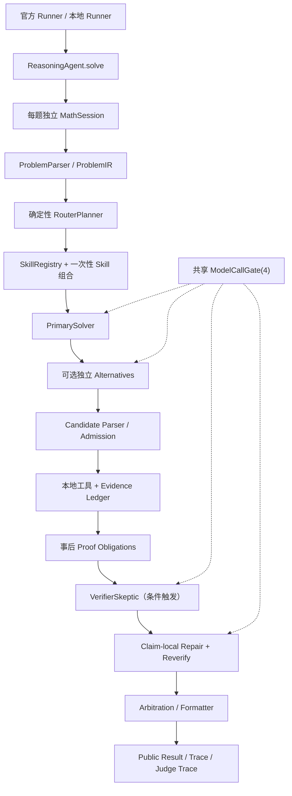

# MathForge / Math-Agent 全项目复审报告：稳定产出、准确率与单题长程推理

**审查日期：** 2026-07-30
**审查对象：** 当前工作区 `MathForge / Math-Agent` 全部运行代码、配置、Prompt、Skills、工具、记忆、Harness、测试和本地运行脚本
**审查性质：** 只读代码审查、静态取证、已有测试/运行产物复盘和小规模离线探针
**本报告目的：** 找出影响高难度一般数学题稳定答案产出和答案准确率的全部主要问题，说明根因，给出逐项解决方案、验收标准和分阶段实施计划。

> 本报告的目标是提升**一般高难度数学问题**的处理能力，不是把系统改造成只服务于奥赛题的专用系统。函数、分析、代数、概率、离散、数论、几何、优化、线性代数等题型都应被统一纳入难度和推理框架。

## 1. 审查范围、证据和限制

### 1.1 覆盖范围

本次审查覆盖：

| 层次 | 主要内容 |
|---|---|
| 入口与契约 | `user_agent.py`、不可变官方入口 `main.py`、输出字段、并发入口 |
| Harness | Session、Budget、Deadline、ModelCallGate、调度、候选编排、证据、Proof Obligation、Repair、Arbitration、Fallback |
| Agent 角色 | `RouterPlanner`、`PrimarySolver`、`AlternativeSolver`、`VerifierSkeptic`、`RepairAgent`、`LemmaCurator`、可选 Finalizer |
| 上下文与 Prompt | ProblemIR、Context View、Compression、PromptCompiler、角色合同、256K 上下文约束 |
| Skills / 工具 / 记忆 | SkillRegistry、静态选择、工具请求重建、工具沙箱、Shadow、SessionMemory、RAG、Frozen Lemma Store |
| 输出与观测 | Candidate Schema、答案形状、仲裁、Trace、Judge Trace、状态、格式化、指标 |
| 工程与测试 | 目录结构、代码复杂度、异常边界、测试、覆盖率、CI、打包和配置治理 |

### 1.2 关键证据

- 当前代码规模约为 135 个 Python 文件、约 2.8 万行；测试约 552 个。
- 最大的控制流集中在 `mathforge/runtime.py`：约 3234 行，其中 `solve()` 约 2178 行；这是最重要的可维护性和异常隔离风险。
- 另有大文件：`scripts/run_case_outputs.py`（约 1692 行）、`mathforge/output/judge_trace.py`（约 1445 行）、`mathforge/harness/schemas.py`（约 1353 行）、`mathforge/benchmark.py`（约 1162 行）。
- `config/competition.json` 当前仍为 `status: candidate-unvalidated`，模型并发为 4、每题最多 6 次模型调用、外层限制 900 秒。
- 最近一次 Phase7 canary（4 题）产生 4 个结果文件，其中 3 个有数学答案、1 个无答案；共 8 次模型调用，3 次完成、5 次传输失败。该结果证明：**主要故障发生在模型传输/调度与候选保全链路，而不是所有候选都被严格验证门禁淘汰**。
- 同一次 canary 的答案匹配器把 `\pi^2/6` 与 `\frac{\pi^2}{6}` 等数学等价表达判成不一致，导致报告中的正确率被低估；必须先修复评测器再做真实自校准。
- 既有针对性测试曾通过 36 项；完整干净测试在当前 Windows 临时目录权限下未获得可信的全绿结果，因此不能把当前工作区宣称为“全量测试通过”。
- `ruff`、`mypy` 在当前执行环境中未安装；CI 会安装，但 CI 当前没有执行 `coverage` 的 `fail_under=80` 门禁。
- 本次复核现场运行：`tests/test_budget.py`、`tests/test_orchestration.py`、`tests/test_s3_reasoning_context.py` 为 **23 passed**；工具/解析/Prompt/Skills 子集为 **38 passed、1 个 pytest `tmp_path` setup error**。该错误来自 Windows `C:\Users\LEGION\AppData\Local\Temp\pytest-of-LEGION` 权限，不能计为代码测试失败，也不能计为全量通过。
- `python -m compileall -q mathforge user_agent.py` 本次通过；这只证明语法可编译，不替代全量行为测试。

### 1.3 不能据此下的结论

1. 不能把最近的失败简单归因于“4 路并发一定超过官方容量”；代码层面题目闸门和模型物理闸门均为 4，失败样本也没有出现排队超时或后台尾调用占满的证据。需要用并发 1/2/4 的真实容量实验区分网络、服务端限流和调度问题。
2. 不能把“证明不完整”当成“候选全部被淘汰”。当前多数普通候选会以 `best_available/incomplete` 形式保留；真正致命的是没有候选、预算重规划异常、下游异常覆盖候选和低风险路径无备用生成。
3. 不能通过保存私有 Chain-of-Thought 解决长程推理。需要保存公开、可验证的数学状态、子目标、Claim、证据和轮次增量。
4. 不能通过新增 API 客户端、读取私有字段或设置模型环境变量解决问题。项目的模型边界应继续只使用注入的 `client.chat(messages=..., temperature=..., max_tokens=...)`。

## 2. 总体结论

### 2.1 当前系统的真实定位

当前系统更准确的描述是：

```text
一次 Primary 解答
  + 可选的独立 Alternative
  + 事后本地工具/证据检查
  + 摘要级 Verifier
  + Claim-local Repair
  + 确定性 Arbitration 与格式化
```

它是一个有较完整工程骨架的**候选集成 Harness**，不是已经完成的单题长程对话 Agent，也不是能稳定处理所有高难度题的闭环数学求解器。

### 2.2 对稳定答案产出的首要阻断

按优先级排序，最直接导致“没有正常结果”的问题是：

1. **预算重规划可能缩小已使用阶段的配额**，从而抛出 `existing ... calls exceed allocation plan`，整题回退。
2. **下游任意异常可能覆盖已经生成的候选**，回退到没有数学答案的通用 fallback。
3. **低风险题只有一个 Primary 分支**；Primary 两次传输失败后，剩余预算不能转成备用答案。
4. **普通连接/读取失败没有进入共享 Provider 健康状态**，系统仍可能把资源花在 Verifier、Lemma 或低价值阶段。
5. **并发物理上限匹配不等于阶段排队可用**：Verifier 优先级高于 Alternative，15 秒固定排队预算明显短于 60–165 秒的模型阶段。
6. **评测器的数学等价判断不可靠**，真实准确率和自校准会被错误数据污染。

### 2.3 对准确率的首要阻断

1. ProblemIR 过浅，存在英文行首 `A ` 被识别为选项、答案类型过早硬化、多目标题无法表达等误判。
2. 难度路由主要依赖长度、符号和少量关键词，短而难的一般题会走单候选、单轮路径。
3. Verifier 看不到候选的完整公开 `solution_text`，无法发现摘要之外的跳步、条件遗漏和循环论证。
4. Proof Obligation 多在候选生成后才创建，存在结构上无法绑定到 Claim 的义务。
5. 候选答案冲突不一定触发验证，可能按生成顺序稳定地选错答案。
6. 工具 Prompt 示例和 Host 参数重建协议不一致，工具常常无法从自然语言 Claim 构造可执行参数。
7. Skills 的 `triggers` 只被校验，运行时仍由硬编码分支选择；工具和记忆主要做事后审查，不能推动下一轮求解。
8. Prompt 既要求一次调用完成完整证明、Claim 图和严格 JSON，又将实际 Solver 输出限制为约 8192 tokens，形成一次完成压力。

## 3. 当前整体架构与工作闭环



### 3.1 架构中合理的部分

- `ReasoningAgent` 复用一个 Harness，但每次 `solve()` 创建独立 Session，隔离题目状态。
- 模型调用统一经过共享闸门，未发现通过私有客户端绕过注入接口的设计。
- Alternative 不读取 Primary 完整答案，保留方法独立性。
- Candidate 支持严格 JSON、结构恢复和答案恢复，方向上兼顾模型可用性和契约约束。
- Hard Evidence 优先于加权评分，`best_available` 能保留验证不完整但未被硬证据否定的候选。
- Repair 以 Claim 为粒度、带版本、可重新验证并有回滚方向。
- Trace / Transport / Budget / Loop Health 已有可观测骨架。

### 3.2 架构中不合理的边界

- 同一个 `runtime.py` 同时承担生命周期、预算重规划、候选编排、上下文构造、工具执行、验证、仲裁、异常恢复和输出，任何一处异常都可能跨越多个阶段。
- Agent 角色是固定角色的同模型编排，不是自主多 Agent 协作；这并非问题本身，但 Prompt 和文档不能把它描述成“多智能体已经完成长程推理”。
- Deterministic service 与 LLM role 的职责边界总体正确，但当前工具、引理和 Verifier仍多为后处理，没有把反馈送回 Solver 的公共状态。
- 运行配置有多层来源（JSON、Prompt frontmatter、Compiler 常量、Provider 上限），有效值无法从一条 Trace 解释。

## 4. Harness、并发、预算与闭环审查

### H0-01（阻断）预算重规划会否定历史调用

**证据：** 初始规划 `runtime.py:517`，证据后规划 `runtime.py:1030`，Verifier 前规划 `runtime.py:1469`；`allocation.py:67-109` 可能把 Primary 从 2 缩回 1；`budget.py:106-115` 会拒绝新配额小于历史使用量。

**影响：** 高风险题 Primary 已使用第二次恢复调用后，Repair/Reverify 重规划可能直接异常，已生成答案被整题 fallback 覆盖。

**解决：**

- `set_allocation_plan()` 改为接收 `used_by_stage`，新计划逐阶段满足 `limit >= used`。
- 历史调用是不可撤销下界；只对未启动阶段做增量分配。
- Repair + Reverify 只从剩余预算中预留，不得抢占 Primary/Alternative/Lemma 的已消费额度。

**验收：** 对所有合法阶段序列做属性测试；Primary、Alternative、Lemma 已消费后任何重规划均不抛预算异常；Harness 内部预算异常触发 fallback 为 0。

### H0-02（阻断）缺少最后安全候选检查点

**证据：** 候选在 `runtime.py:823` 进入 Session、`runtime.py:1216` 形成 viable 集合；后续异常在 `runtime.py:2161-2189` 进入通用 fallback，`harness/fallback.py` 不产生数学答案。

**影响：** Verifier、仲裁、Trace 或格式化中的非数学异常，会丢掉一个可能正确的候选。

**解决：** 为每题维护 `generated → admitted → hard_evidence_passed → arbitrated` 的 `last_safe_checkpoint`；异常时从最后未被硬否定的候选确定性格式化，状态标记 `degraded_candidate_salvage`；只有不存在任何候选时才用通用 fallback。

**验收：** 在证据后、Verifier 前、仲裁中、格式化中分别注入异常；只要存在未硬失败候选就必须返回数学答案，且不能恢复 hard-failed Candidate。

### H0-03（阻断）低风险路径无可靠性备用分支

**证据：** `router_planner.py:404-415` 将 low 路由为 1 个候选；`orchestration.py:76-90` 只构造规划中的分支；Primary 重试见 `solver.py:27,134`。

**影响：** Primary 连续两次连接/读取失败时，即使剩余 4 次调用和时间都足够，也没有 Alternative 形成答案。

**解决：** 将“质量 fanout”和“可靠性 fanout”分离；为 low 路由预构建但不立即执行的 Standby Alternative；仅在 Primary 无候选、且时间/预算可完成时执行一次不同方法族的备用生成。

**验收：** 两次 Primary 传输失败、备用成功时返回 success 或 degraded-success；Primary 正常时不额外消耗调用；剩余预算足够却直接 `all solver branches failed` 为 0。

### H0-04（阻断）Provider 健康只统计后台尾调用

**证据：** `provider.py:262-274` 主要由超时尾调用更新健康；普通连接/读取错误在 `provider.py:431` 只写入单题 Budget。

**影响：** 连续传输失败后仍可能调用低价值 Verifier、Lemma 或 Finalizer，浪费剩余预算并放大失败面。

**解决：** 在共享 Provider 层维护有限滑动窗口，区分 connect、read timeout、empty response、schema failure、success；进入 `healthy/degraded/open`；degraded 时优先答案生成，暂停低价值阶段；成功后半开恢复。

**验收：** 连续普通失败能进入 degraded；偶发失败不永久熔断；恢复调用能回 healthy；健康状态改变调度决策而非仅写指标。

### H1-01（高）物理并发匹配，但队列与阶段价值不匹配

**现状：** 官方入口常量为 8，`user_agent.py` 题目闸门为 4，配置模型物理并发为 4；Verifier 优先级高于 Alternative，模型队列预算为 15 秒，而单次阶段可运行 60–165 秒。

**影响：** 4 个 Primary 占满模型闸门时，Alternative 很容易在短队列窗口内被丢弃；计划中的多候选不能稳定形成。物理峰值不越界，但候选覆盖率下降。

**解决：** 保留物理上限 4；增加等待老化/每题轮转和答案生成配额；队列预算按剩余 Deadline 与阶段 p95 动态计算；一次拿不到 permit 不立即将分支判为失败。

**验收：** 并发 1/2/4 峰值均不超过 4；健康服务下计划候选形成率 ≥95%；Alternative 不被 Verifier 长期饿死。

### H1-02（高）预算只按次数，不按时间可行性

**现状：** `soft=600s`、`exploration=720s`、`hard=850s`、最终保留 50s、模型启动余量 100s；Repair 原子门主要只检查剩余调用数。

**影响：** Repair + Reverify 在调用次数上合法，按真实延迟却可能无法在 900 秒内完成，形成半个修复流程并损失原候选。

**解决：** 保存各角色 p50/p95 延迟；Repair+Reverify 只有在“剩余时间 ≥ 两阶段下界 + 格式化余量”时启动；否则保留原候选并标记未完成。

**验收：** Fake clock 覆盖 100/200/350 秒剩余时间；不启动必然无法复验的 Repair；外层结束后不留无界工作。

### H1-03（高）模型物理闸门与服务容量未经标定

**影响：** 代码并发 4 不代表代理/API 在并发 4 下稳定；当前 canary 只能证明一轮服务质量不足，不能区分代理、远端限流和模型本身。

**解决：** 固定同一题集做并发 1/2/4，各重复至少 3 轮，记录连接成功率、阶段成功率、p50/p95、答案产出率、正确率和排队时间；只有数据支持时才冻结并发 4。

## 5. Agent 设计与候选闭环审查

### 5.1 当前是否是 Multi-Agent

严格说是**固定角色的同模型多角色编排**，不是多个独立模型或自主 Agent 的协商系统：

- `PrimarySolver` 产生主候选；
- `AlternativeSolver` 独立产生候选；
- `VerifierSkeptic` 审查；
- `RepairAgent` 修复局部 Claim；
- `LemmaCurator` 主要整理已有 Claim；
- Host 负责解析、工具、证据、预算、仲裁和输出。

这样的架构是合理的起点，因为确定性服务比让每个 Agent 自行管理预算和安全边界更可靠；问题在于角色之间没有共享**公开数学工作状态**，所以角色数量增加并不会自动带来长程推理。

### 5.2 H1-04（高）短而难的一般题容易低估

**证据：** `router_planner.py:569-588,643-690` 主要使用长度、条件数、符号数和少量关键词；`candidate_count` 与 `max_reasoning_rounds` 在 `router_planner.py:404-415` 只随 low/medium/high 变化。离线探针中复杂积分、参数优化、函数空间题可被判 low/medium。

**解决：** 增加与题型无关的结构特征：

- 量词交替、条件耦合、参数区域；
- 复合/嵌套算子、特殊函数、极限交换和收敛条件；
- 存在唯一性、分类/枚举、反例构造；
- 目标类型不确定、多目标和跨域依赖；
- Primary 后验信号：答案恢复、Claim 为空、未解决义务、Shadow 冲突、方法偏离。

路由只允许在不确定时**升档**，不能静默降档；不应依赖奥赛专用关键词。

### 5.3 H1-05（高）Proof Obligation 事后创建且可能结构上不可满足

**证据：** 候选后创建见 `runtime.py:1241`；按 `claim_kind` 绑定见 `verification/proof_obligations.py:121`；Verifier 只接受 obligation 的 `source_claim_ids` 中的 Claim。

**解决：** 在第一次 Solver 调用前从 ProblemIR 建立题目级义务；将义务种类注入公开 Prompt；候选后只增加方法触发的义务；使用显式 `obligation_id → claim_id/evidence_id` 映射。

**验收：** 进入 Verifier 的义务必须可映射或明确 `unmapped`；结构上不能 pass 的义务不得触发模型审查。

### 5.4 H1-06（高）候选冲突不一定触发验证

**证据：** `runtime.py:1455-1468` 的 Verifier 触发主要依赖 required obligations；`arbitration.py:92-97` 在无证据冲突时可能按稳定生成顺序选 Primary。

**解决：** 将答案冲突、关键假设冲突和 Proof Obligation 共同作为触发器；先用确定性等价工具聚类；无法决定时做一次批量 answer-level / claim-level 对比审查；将选择证据写入 Trace。

### 5.5 H1-07（高）同模型软审查的“complete”语义过强

**证据：** Verifier Evidence 为 soft（`evidence.py:115,134`），但 `completion.py:84-90` 可将 soft pass 用于完成义务。

**解决：** 分离 `hard_verified`、`independently_corroborated`、`model_review_passed`、`incomplete`、`failed`；soft pass 只能提升排序和健康度，不能冒充硬证明。

### 5.6 候选 Schema 的利弊

优点是字段结构可解析、Host-owned 字段不由模型决定、失败有恢复层。缺点是一次调用同时要求完整公开推导、Claim 图、证据建议、工具请求和严格 JSON；这增加了格式失败和恢复调用，挤占真正求解预算。

**解决：** 将输出分成两个公开协议：

1. `ProgressDelta`：计划、子目标、原子 Claim、开放义务、工具工作项、失败摘要；
2. `CandidateSolution`：只在 synthesize 阶段生成最终答案、公开解答和引用的 Claim/Evidence ID。

Progress 不要求最终答案字段，Candidate 不要求重复完整中间状态；两者都禁止私有 CoT。

## 6. 单题长程推理：当前能力与目标设计

### 6.1 当前并不具备真正的长程对话推理

当前实际行为：

- Primary 通常只调用一次；第二次调用是网络/Schema 恢复，不是延续上一轮数学状态。
- Alternative 看不到 Primary 完整答案，只能独立求解。
- Verifier 主要看摘要、Claims 和步骤，而非完整公开解答。
- Lemma loop 最多两轮，且只在高风险证明/推导题触发。
- 第二轮 Lemma 扩展在 `runtime.py:2846-2860` 传入空候选、空证据和有限 `raw` 记忆。
- `SessionMemory` 保存元数据、路由和证据 ID，不是数学黑板；冻结引理库当前记录数为 0。

因此，当前系统不能稳定完成“分解子目标 → 推进局部结论 → 工具反馈 → 修订策略 → 继续推导 → 综合答案”。

### 6.2 建议的公开 ReasoningState

```text
ReasoningState
├─ ProblemFrame（原题、定义、量词、约束、目标，不可丢失）
├─ SubgoalLedger（子目标、依赖、状态、负责人、退出条件）
├─ ClaimLedger（accepted / rejected / pending Claim）
├─ EvidenceLedger（工具、硬证据、软复审、适用范围）
├─ OpenObligations（显式 obligation_id 与依赖）
├─ Contradictions（候选冲突和反例摘要）
├─ ToolResults（结构化结果及其影响）
├─ Strategy（当前方法和切换原因）
└─ RoundDelta（每轮新增、更新、关闭和下一步）
```

Solver 只输出公开可审计状态，不保存隐藏思维链。一般高难度题使用有限、预算感知的：

1. `explore`：分解目标、提出方法和第一批原子 Claim；
2. `continue`：消费已验证状态/工具结果，只推进一个或少数未解决子目标；
3. `synthesize`：从状态闭包生成最终 Candidate。

简单题仍保持单轮。只有预期信息增益足够、且时间预算可完成时才开启 2–3 轮。

### 6.3 长程循环的停止条件

每轮都必须满足以下至少一项，否则停止并输出最佳可用候选：

- 新增可验证 Claim；
- 关闭一个开放义务；
- 工具结果排除一条方法或确认一个关键等式；
- 解决候选冲突；
- 产生比当前候选更强的证据覆盖。

连续两轮无信息增益、剩余时间不足、模型服务 degraded 或状态无法通过不变量校验时，不再继续扩张。

## 7. Prompt、上下文、Skills、工具与记忆审查

### 7.1 H1-08（高）256K 配置没有真正传达到角色

**证据：**

- 配置宣称 `model_context_window_tokens=262144`，原始上下文 `raw_context_max_chars=48000`。
- Prompt 合同为 Primary 24000、Alternative 20000、Verifier 40000 字符。
- `runtime.py:2540-2544` 又取合同的一半，Primary 实际 RoleContext 约 12000 字符。
- `prompt_compiler.py:21-38` 将 Solver profile 实际输出统一限制为约 8192 tokens，覆盖了配置中的 `primary_max_tokens=65536`。

**影响：** 题面长、条件多或需要多轮状态时，系统在远未接近模型 256K 能力前就报上下文超限或丢字段。

**解决：**

- 用统一 token 预算器而不是固定字符折半；保留原题、定义、量词、目标、关键 Claim 依赖和开放义务。
- 维护 `prompt_tokens + state_tokens + output_tokens + safety_margin <= 256K` 的硬不变量。
- 输出预算按难度/轮次动态分配（先以离线校准为准，不盲目放大到 65K）。
- Trace 记录配置值、Compiler cap、Provider cap、实际 Prompt token、可用剩余量。

### 7.2 H1-09（高）Prompt 存在两个事实源

`PromptContract.render_system()` 会包含完整 contract body（`registry.py:241-255`），而生产 `PromptCompiler._compile()`（`prompt_compiler.py:250-290`）只拼 frontmatter header 和代码 instructions。测试验证的路径与生产发送的 messages 可能不一致。

**解决：** 只保留一个编译入口；对实际发送的 `messages` 做快照和哈希测试；Prompt 合同中的 schema、禁止项和工具格式必须来自同一结构化定义。

### 7.3 H1-10（高）Verifier 看不到完整公开解答

`context/views.py:14-15` 删除 `solution_text`。该字段是模型被要求输出的公开、可检查数学解答，不是私有 CoT。删除它会漏掉摘要 Claim 未覆盖的跳步。

**解决：** Verifier 接收完整公开解答，超预算时使用段落 ID → Claim ID 的确定性压缩；继续禁止私有草稿、失败候选全文和任何秘密。

### 7.4 H1-11（高）工具协议与 Prompt 示例不一致

`tool_prompt_examples.py` 使用自然语言 Claim，而 `verification/tool_requests.py:109-168` 要求字面 `=`、`density[...]`、`cases[...]` 等格式。离线探针中 9 个示例只有少数可以端到端构造请求。

**解决：**

- Candidate Claim 增加 Host 控制的结构化 `check_spec`（表达式、变量、区间、样本、矩阵等）。
- Prompt 示例由同一 schema 自动生成，避免手工双写。
- 参数不可构造时触发一次公开的“Claim 重述/工具工作项”续轮；不能把不可构造误报为数学硬失败。
- 增加 Claim → ToolRequest → ToolResult 端到端测试。

### 7.5 H1-12（高）Skills 不是动态选择

Skill frontmatter 的 `triggers` 在 `registry.py` 中被读取和校验，但选择仍主要由 `router_planner.py:426-508` 硬编码；每轮不会根据当前子目标、失败证据和工具结果重新选择。当前卡片偏通用检查清单，缺少适用条件、排除条件、失败模式和退出条件。

**解决：** 用 ProblemIR + Subgoal + OpenObligation + FailureCode 做确定性评分；每轮仅注入角色需要的片段，并在 Trace 记录 included/omitted/rank/reason；以一般数学方法卡为主，不做奥赛专用硬编码。

### 7.6 H1-13（高）记忆和引理没有形成有效知识增益

- RAG 默认关闭，知识卡约 8 张且主要是程序性卡片。
- Frozen Lemma Store 启用但 manifest record_count 为 0。
- LemmaCurator 主要复制当前 Candidate Claim，义务匹配存在字符串包含逻辑。
- 跨题写入被禁用是正确的评测隔离策略，不能为了“有记忆”而污染后续题。

**解决：** 先建立经过审核的通用方法/定理卡，明确前置、排除和失败模式；只读、版本化、离线 A/B 验证后再启用；空库时关闭能力。问题内记忆使用 `ReasoningState`，跨题知识库保持只读。

### 7.7 模型能力与项目包装的关系

Intern-S2-Preview-397B 官方模型卡将其定位为科学智能和长程 Agent 模型，文本推理评测最大推理长度为 256K，并给出较高温度采样建议；官方 API 示例使用模型标识 `intern-s2-preview-397b`。[官方模型卡](https://huggingface.co/internlm/Intern-S2-Preview-397B) 、[官方 InternLM 仓库](https://github.com/InternLM/Intern-S1)

这说明模型本身具备长上下文和 Agent 能力方向，但**不等于当前包装器已经实现长程推理**。当前 12K 左右角色上下文、8192 输出 cap、单轮 Candidate 协议和事后工具验证，实际上没有让模型发挥这些能力。

采样参数不应直接照抄模型卡：Primary 应优先稳定和可解析，Alternative 才增加多样性，Verifier 可接近 0；必须用同一一般高难度集做温度/输出长度 A/B，不能把“温度更高”当作准确率保证。

## 8. 代码级模块审查与问题清单

### 8.1 模块合理性总表

| 模块 | 当前职责 | 判断 | 主要问题 | 建议 |
|---|---|---|---|---|
| `user_agent.py` | 官方注入客户端适配、题目闸门、公共契约 | 边界正确 | 广泛异常转最小 fallback，错误类别被掩盖 | 保留 no-throw 边界；返回非敏感错误码和恢复层级 |
| `mathforge/runtime.py` | 全流程编排 | 功能齐全但过度集中 | 3234 行、`solve()` 超长；阶段异常相互覆盖；重规划缺历史下界 | 按 Parse/Plan/Generate/Verify/Repair/Arbitrate/Emit 拆服务，先加 characterization tests |
| `agents/router_planner.py` | 难度、领域、候选数、技能 | 方向合理 | 特征浅、短难题漏检、Skill 选择硬编码 | ProblemIR v2、结构难度特征、后验升档 |
| `agents/solver.py` | Primary/Alternative 调用和重试 | 边界清晰 | 重试占用求解预算；无 continue 模式 | 分离 transport/schema retry 与 reasoning continuation |
| `agents/verifier.py` | 模型复审、发现 findings | 角色合理 | 看不到完整公开解答；soft pass 语义过强 | 完整公开解答 + 多级证据状态 |
| `agents/repair.py` / `harness/repair.py` | Claim-local 修复 | 设计方向好 | 时间门只看次数；修复触发过晚 | 原子可行性门、版本化状态差分、失败保留原候选 |
| `harness/schemas.py` | 所有会话/候选/证据数据结构 | 契约完整 | 1353 行、字段耦合大；没有公共 ReasoningState | 增加独立版本化状态 schema，拆分 domain schemas |
| `harness/budget.py` / `allocation.py` | 次数预算和阶段规划 | 有边界检查 | 计划可缩小历史使用；没有时间成本 | 单调计划 + 时间预算 |
| `harness/provider.py` | 注入 client 调用、超时、健康 | 安全边界正确 | 普通失败不更新共享健康；尾线程长期占 permit | 失败窗口、健康驱动降级；不虚假释放 permit |
| `harness/orchestration.py` | 候选并发/分支隔离 | 独立性好 | 低风险无 standby；优先级饿死 Alternative | 可靠性备用 + 公平队列 |
| `harness/priority_scheduler.py` | 全局阶段调度 | 有调度骨架 | 固定优先级无老化/题目公平 | aging、case round-robin、答案生成保底配额 |
| `parsing/problem_parser.py` | ProblemIR 初解析 | 轻量可解释 | 选项正则误判；字段浅 | 明确枚举格式、低置信度软门、ProblemIR v2 |
| `parsing/solution_parser.py` | Candidate JSON/文本恢复 | 兼顾容错 | 大函数、恢复与语义校验耦合 | 分层 parser：transport/schema/semantic/normalization |
| `verification/admission.py` | Candidate 入场 | 必要 | answer_type 误判会硬拒 | 低置信度可恢复；区分形状错误与数学错误 |
| `verification/evidence.py` | 硬/软证据分类 | 核心正确 | 工具参数不可构造；soft/hard 语义混合 | `hard_verified` 等多级状态 |
| `verification/proof_obligations.py` | 义务生成/绑定 | 有形式骨架 | 事后生成、claim_kind 弱匹配 | 问题级预义务 + 显式 ID 映射 |
| `verification/arbitration.py` | 证据优先仲裁 | 稳定性好 | 纯冲突无验证可能顺序选答 | 冲突触发 answer-level review |
| `tools/registry.py` / `executor.py` | 能力白名单、沙箱、执行 | 安全方向好 | 工具多为事后检查，协议不统一 | Host 中介 work item + 结果回注 |
| `tools/shadow_solver.py` | 确定性/影子核验 | 有价值 | 能力窄，不能当完整求解器 | 明确为低成本冲突信号，不直接替代模型 |
| `memory/session_memory.py` | 题内记忆 | 隔离正确 | 没有数学黑板 | 改为 ReasoningState 的只读投影 |
| `memory/problem_memo.py` | 题内缓存 | 可选优化 | 作用域容易与长期知识混淆 | 明确 solve-local 生命周期和清空测试 |
| `memory/frozen_lemma_store.py` | 冻结跨题知识 | 当前无收益 | 空库却启用 | 空库禁用；审核后再启用 |
| `output/deterministic_formatter.py` | 最终公开答案 | 方向正确 | 下游异常可能无法到达 | 绑定 last-safe checkpoint |
| `output/judge_trace.py` / `harness/trace.py` | 观测与评测 trace | 信息较丰富 | 内外字段语义、长度和敏感性边界复杂 | 版本化 schema、状态/轮次/候选摘要，不输出私有 CoT |
| `evaluation/scoring.py` | 正确性评估 | 必须修 | 字符/格式等价不足，污染 canary 指标 | SymPy/答案类型等价分层 + golden tests |
| `benchmark.py` / `scripts/run_case_outputs.py` | 批量运行与落盘 | 功能齐全 | 1692 行脚本、入口状态语义不一致 | 抽出 Runner service；单题原子落盘和 manifest 状态 |
| `config.py` / JSON 配置 | 配置约束 | 有校验 | 多来源有效值不可解释，candidate-unvalidated | 单一有效配置快照、启动约束检查 |

### 8.2 代码结构和异常处理问题

1. **高复杂度集中：** `runtime.solve()`、`judge_trace.project()`、`solution_parser._from_payload()`、`trace.validate()`、`benchmark` 指标函数均需要拆分；先提取纯函数和不变量，避免一次重构引入行为漂移。
2. **宽泛异常边界过多：** `user_agent.py` 和最外层 no-throw 是必要的，但 `runtime.py`、工具执行、Lemma loop、Repair 等内部路径多处 `except Exception` 会把预算、解析、网络、逻辑错误混成同一类。内部应转换成枚举化、非敏感的 typed failure；只有公共边界保留兜底。
3. **状态机缺少统一事务边界：** Candidate、Evidence、Repair、Trace 和 Budget 的更新不是一个明确的 checkpoint transaction；需要“提交候选/回滚修复/发布证据”的原子操作。
4. **配置静默取最小值：** JSON 的 65536、Compiler 的 8192、Provider cap 的 32768 和角色合同字符上限并存，实际行为不透明。
5. **脚本和库逻辑重复：** `run_case_outputs.py`、`benchmark.py`、`runtime.py` 都有运行/落盘/状态处理逻辑，易产生官方入口和本地测试结果差异。
6. **测试偏向现有契约：** 某些测试把“第二轮不带历史解答”视为预期，且工具测试预填 `host_arguments`；这会掩盖真实长程状态和真实 Claim 重建缺陷。
7. **打包风险：** `pyproject.toml` 将 `data/*` 全量作为 data-files，包含 dev gold 和评测资料；应审查提交包是否泄漏答案或不必要地增大部署面。

### 8.3 输出状态、Trace、测试和发布治理问题

#### H2-01（高）官方 Runner 会覆盖 Agent 的失败状态

`main.py` 的 `build_output_record()` 固定写入 `status="success"`。该文件属于官方基线，不能修改；因此本地 Runner 与官方 Runner 的状态语义存在差异。若不在文档和评测中明确区分，用户会看到“Agent 明明失败但结果状态成功”。

**解决：** 不修改 `main.py`；确保 `user_agent.py` 返回的 `final_response`、`trace` 和内部终态真实；本地脚本保留 `success/degraded/failed`；在提交说明中明确官方包装层的固定状态限制。

#### H2-02（高）公共 no-throw 边界掩盖内部错误类别

`user_agent.py` 为保证契约对所有异常返回最小 fallback，这是必要的安全边界；但若内部只抛出宽泛异常，Trace 无法区分传输失败、预算错误、解析错误、验证失败和格式化失败，导致排障只能依赖猜测。

**解决：** 内部采用非敏感 `failure_code`、`failed_stage`、`recoverable`、`safe_checkpoint` 字段；公共层仍不抛异常，但不再把所有错误压成同一个 `failed`。

#### H2-03（中高）Trace 没有长程状态和信息增益，而公共投影又有固定上限

内部 Trace 可以很长，竞赛配置却把 Judge Trace 限制为 64 个事件/196,608 字符。现有事件能反映路由、候选、证据和仲裁，但不能反映子目标、轮次增量、工具结果对策略的影响和停止原因；一旦事件被裁剪，无法判断长程闭环是否真的工作。

**解决：** 为每个轮次提供一个确定性 `round_summary`，保存 `state_id`、新增/关闭的 subgoal、Claim/Evidence ID、信息增益、下一步、停止原因和降级原因；事件裁剪优先保留摘要，不输出私有推理、完整失败候选或秘密。

#### H2-04（中高）单题结果落盘和 manifest 状态可能不一致

本地批量脚本、Benchmark 和官方入口各自维护运行状态；既有产物出现过 manifest 停留在 `running`、结果文件已经存在，或单题状态与汇总状态不同的情形。

**解决：** 单题结果采用临时文件 → `fsync` → 原子 rename；每题结束立即更新 manifest；启动时恢复 `running` 项为 `interrupted`，不可把未完成项误报为成功。

#### H2-05（中高）CI 没有真正执行覆盖率门禁，Windows 全量测试还受临时目录影响

`pyproject.toml` 声明 `fail_under=80`，但 CI 工作流没有执行 `coverage report`/`check_coverage_gates`。当前 Windows 环境的 pytest 临时目录权限导致大量 setup error，覆盖率数字不能当作干净基线。

**解决：** CI 显式执行覆盖率门；测试使用仓库内可写临时根或 pytest `--basetemp`；同时保留 Linux 和 Windows 的无网络/并发/超时矩阵。

#### H2-06（中）真实模型 A/B 配置没有单一有效快照

模型名、温度、输出 token、角色合同、Provider cap 和上下文安全余量来自不同层，运行结果中难以回答“本题究竟用的是什么有效参数”。

**解决：** 启动时生成脱敏 `effective_config`，每题 Trace 引用其哈希并记录各层取值和最终生效值；模型名称只作为运行参数/官方注入配置，不写入 API key 或隐式环境变量。

#### H2-07（中）评测资料随安装包传播

`pyproject.toml` 的 `data/*` 全量打包，包含 dev gold、路由校准和评测证据。即使当前不是生产泄漏，也会增加提交包和运行镜像暴露答案的风险。

**解决：** 将公开运行时资源与开发/评测资源分离；提交包只带必要 schema、Prompt、Skills 和公开知识卡；gold/私有校准数据在评测环境单独挂载。

#### H2-08（中）密钥治理依赖人工操作

代码扫描未发现应提交的明文密钥，但真实测试密钥曾通过聊天/终端输入。密钥一旦进入聊天记录、shell history 或日志就不再是可控秘密。

**解决：** 测试前轮换已暴露 token；使用临时进程环境或官方注入机制；日志和 Trace 只记录 provider/model 的脱敏标识，不记录 Authorization、请求头或完整 endpoint token。

## 9. 逐项问题优先级与解决目标

| 编号 | 优先级 | 问题 | 直接目标 |
|---|---:|---|---|
| S0-01 | P0 | 历史预算可被缩小 | 不因 Harness 自身规划异常丢答案 |
| S0-02 | P0 | 下游异常覆盖候选 | 有未硬否定候选必返回数学答案 |
| S0-03 | P0 | Low 路径无备用答案生成 | 模型短暂失败仍能产出 |
| S0-04 | P0 | Provider 健康不反映普通失败 | 把剩余调用给答案生成 |
| S0-05 | P0 | 数学等价评测错误 | 正确率和自校准可信 |
| S1-01 | P1 | 阶段队列饿死 Alternative | 候选形成率稳定 |
| S1-02 | P1 | 次数预算无时间可行性 | 不启动无法完成的 Repair |
| S1-03 | P1 | 短难题路由低估 | 高难度召回达到冻结目标 |
| S1-04 | P1 | ProblemIR/答案类型误判 | 不因表示误判硬拒正确答案 |
| S1-05 | P1 | 义务事后且不可映射 | Verifier 只审可执行义务 |
| S1-06 | P1 | Verifier 缺公开解答 | 能发现跳步和条件遗漏 |
| S1-07 | P1 | 冲突不触发验证 | 不按生成顺序静默选答 |
| S1-08 | P1 | soft pass 冒充 complete | 证明等级真实可解释 |
| S1-09 | P1 | 有效上下文/输出远小于配置 | 充分利用窗口且不超 256K |
| S1-10 | P1 | Prompt 双事实源 | 测试与生产发送一致 |
| S1-11 | P1 | 工具 Claim 协议不一致 | 工具参数可构造率 ≥90% |
| S1-12 | P1 | 无公共长程状态 | 复杂题可有限多轮推进 |
| S2-01 | P2 | Skills 静态硬编码 | 每轮按子目标选择方法 |
| S2-02 | P2 | Lemma/交叉审阅弱 | Claim 依赖和冲突可追溯 |
| S2-03 | P2 | 记忆/RAG 空或无验证收益 | 只启用经 A/B 证明有效的知识 |
| S2-04 | P2 | Candidate Schema 一次完成压力 | 减少格式失败，保留求解预算 |
| S2-05 | P2 | 工具只做事后验证 | 工具结果能推动下一轮求解 |
| S2-06 | P2 | 影子求解器能力窄 | 仅作为冲突信号，不误当证明 |
| S3-01 | P2 | Runtime/脚本过长 | 阶段可独立测试和恢复 |
| S3-02 | P2 | 内外错误状态语义不一致 | status/降级原因可追踪 |
| S3-03 | P2 | 测试和 CI 不完整 | 全量质量门禁真实生效 |
| S3-04 | P2 | 打包包含评测资料 | 降低泄漏和部署风险 |
| S3-05 | P2 | Trace 缺轮次和信息增益 | 可诊断长程闭环是否工作 |
| S3-06 | P2 | 官方/本地状态与落盘不一致 | status、manifest、文件原子一致 |
| S3-07 | P2 | 有效配置不可解释 | 每题可复现实际参数 |
| S3-08 | P2 | 密钥治理依赖人工 | 不进入代码、Trace、日志和提交包 |

## 10. 详细整改实施计划

### Phase 0：证据冻结、评测器修复与回归基线（预计 2–3 个工作日）

**目标：** 在不改变模型接入方式的情况下，建立可信基线。

任务：

1. 修复答案等价评测：按 answer type 使用 SymPy/集合/区间/矩阵/文本规范化；为 `\frac{\pi^2}{6}`、`8\pi^6/63` 等等价表达建立 golden tests。
2. 固定三组数据：
   - `reliability`：注入连接失败、读取超时、空响应、Schema 错误；
   - `general_high_difficulty`：覆盖分析、代数、概率、离散、数论、几何、优化、线代、特殊函数、参数题，不按奥赛标签组织；
   - `contract_adversarial`：长条件、行首 `A `、多目标、工具 Claim、候选冲突、压缩。
3. 记录每题的答案产出率、评分正确率、候选形成数、硬证据覆盖、调用次数、p50/p95、状态和 fallback 原因。
4. 为每个现有问题建立失败测试；保持 `main.py`、`llm_client.py` 不改，继续使用注入 `client.chat`。

**验收：**

- 评分等价回归 100% 通过；
- 当前工作区得到可复现的基线 manifest；
- 能区分 transport、schema、logic、verification、formatting 五类失败；
- 基线文件校验通过。

### Phase 1：稳定答案保全（预计 2–4 个工作日）

任务：

1. 实现单调预算重规划；
2. 加入 `last_safe_checkpoint` 和 `degraded_candidate_salvage`；
3. 加入低风险 lazy Standby Alternative；
4. 普通传输失败更新共享 Provider 健康并影响阶段选择；
5. 将内部异常转换为 typed non-secret failure。

**验收门：**

- 有未硬否定候选时数学答案产出率 100%；
- Primary 两次失败但备用成功时不返回空答案；
- Harness 自身异常导致的通用 fallback 为 0；
- 不增加正常低风险题的无条件模型调用。

### Phase 2：并发、公平和 Deadline（预计 3–5 个工作日）

任务：

1. 保留模型峰值 4，但引入任务/阶段 aging 与 case round-robin；
2. 将固定 15 秒队列预算改为基于剩余 Deadline 和阶段 p95 的可行性预算；
3. 阻止低价值 Verifier 长期抢占尚未形成答案的分支；
4. Repair/Reverify 使用时间原子门；
5. 对并发 1/2/4 进行真实容量标定。

**验收门：**

- 峰值物理并发 ≤4；
- 健康服务下计划候选形成率 ≥95%；
- 单题 900 秒内完成率 100%，无新的无界后台任务；
- 并发 4 相比并发 1 的答案产出率和正确率下降不超过预先冻结容差。

### Phase 3：ProblemIR、路由和有效配置（预计 4–6 个工作日）

任务：

1. 修复选择项正则：裸行首 `A ` 不得自动成为选项；仅接受可靠枚举结构；
2. 设计 ProblemIR v2：definitions、quantifiers、constraints、target_kind、ambiguities、difficulty_features、subproblem_hints；
3. 低置信度 answer type 只能软门控和规范化恢复；
4. 添加一般高难度结构路由特征与 Primary 后验升档；
5. 生成 effective config snapshot，显示最终 Prompt/Provider/Deadline 值；
6. 空 Frozen Lemma Store 自动关闭。

**验收门：**

- 误判对抗集 100% 通过；
- 一般高难度路由召回目标先冻结，建议初始 ≥90%，并控制简单题误升；
- 所有单次调用的有效 token/字符上限可从 Trace 解释。

### Phase 4：公开长程 ReasoningState（预计 5–8 个工作日）

任务：

1. 新增版本化 `ReasoningState`、`ProblemFrame`、`SubgoalLedger`、`ClaimLedger`、`RoundDelta`；
2. 增加 `explore/continue/synthesize` 三种公开 Prompt 协议；
3. 高难度题在信息增益和时间预算满足时启用 2–3 轮；简单题保持单轮；
4. 状态压缩采用 token 预算和语义不变量；
5. Trace 记录轮次、子目标变化、Claim/Evidence 引用、下一步和停止原因。

**验收门：**

- 构造必须跨两轮的任务，第二轮能引用第一轮公开状态；
- 条件、定义、量词、目标、关键 Claim 依赖不丢失；
- 总 Prompt + 输出 + 安全余量始终 ≤256K；
- 不出现私有 CoT；
- 单题仍在 15 分钟内完成。

### Phase 5：Skills、工具和知识反馈（预计 4–7 个工作日）

任务：

1. 基于 ProblemIR/Subgoal/FailureCode 动态选择 Skill 片段；
2. Candidate Claim 增加 Host 控制的 typed `check_spec`；
3. 采用 Host 中介的 `work_item → local tool → ToolResult → continue`；
4. 将 Lemma Loop 改为 typed Claim reuse，并实现目标驱动的局部引理；
5. 建立只读、审核、版本化的通用方法卡库；未通过 A/B 前不启用 RAG/Frozen store。

**验收门：**

- 工具参数可构造率 ≥90%，不可构造只产生 `unknown`；
- 至少一组工具结果能改变下一轮策略并提升正确率；
- Skill included/omitted/selection reason 可追溯；
- 跨题状态零污染。

### Phase 6：验证、交叉审阅和修复闭环（预计 4–6 个工作日）

任务：

1. 在 Solver 前生成题目级 Proof Obligations，候选后追加方法义务；
2. Verifier 接收公开 `solution_text` 或 Claim-linked 段落切片；
3. 答案/假设/关键 Claim 冲突触发 answer-level 或 claim-level review；
4. 区分 hard evidence、independent corroboration、model review、incomplete；
5. Repair 只有在完整复验原子门满足时启动；否则输出原候选和未完成状态。

**验收门：**

- 不存在结构上不可 pass 的 Verifier 调用；
- 冲突答案不再按生成顺序静默决定；
- 只有 soft review 不得标为 hard complete；
- Repair 失败不会覆盖更强的原候选。

### Phase 7：代码拆分、测试与发布治理（预计 5–8 个工作日）

任务：

1. 在 characterization tests 保护下拆出 `lifecycle/plan/generate/verify/repair/arbitrate/emit`；
2. 拆分 `schemas.py`、`judge_trace.py`、`run_case_outputs.py`；
3. 将脚本和库共用同一个 Runner service，单题结果原子写入并立即 flush；
4. CI 加入覆盖率门禁、Windows/跨平台临时目录测试、真实 Claim→ToolRequest 测试；
5. 审查打包内容，移除或隔离 dev gold；
6. 明确官方 `main.py` 固定 success 状态与本地 runner 状态语义差异，不修改不可变文件；
7. 增加 `effective_config` 脱敏快照、manifest 原子更新和 `running → interrupted` 恢复；
8. 对真实测试 token 执行轮换和日志/Trace 脱敏检查。

**验收门：**

- `compileall`、`ruff`、`mypy`、`pytest`、baseline/provenance/secrets/governance 全部通过；
- coverage `fail_under=80` 在 CI 实际执行；
- 清洁环境全量测试无临时目录权限假阴性；
- 模块职责和调用图可由文档复现。

### Phase 8：真实模型校准和发布候选（预计 3–5 个工作日）

任务：

1. 使用用户提供的真实 Intern API 和官方 model id `intern-s2-preview-397b` 做 canary；不在代码或环境变量硬编码 API key/model。
2. 对温度、输出预算、fanout、长程轮次做冻结 A/B；
3. 每个配置在简单集和一般高难度集各重复至少 3 次；
4. 生成对比报告，只有同时满足稳定性和准确率门槛才将配置状态改为 validated。

**验收门：**

- 非空数学答案产出率 ≥98%（服务实际可用样本除外需单独报告）；
- 有候选时内部异常丢失率 0；
- 简单集评分正确率不低于冻结基线；
- 一般高难度集相对基线提升目标先冻结，建议至少 +5 个百分点且无答案产出回退；
- p95 单题时间 ≤硬限制，调用数和成本可解释；
- Trace 无秘密、绝对本地路径、原始异常和私有推理。

## 11. 评测指标、质量门和发布判定

### 11.1 稳定性指标

| 指标 | 定义 | 初始发布门 |
|---|---|---:|
| `answer_yield_rate` | 有可用模型服务时最终 `final_response` 非空且含数学答案的比例 | ≥98% |
| `candidate_loss_rate` | 已生成未硬否定候选却最终丢失的比例 | 0 |
| `harness_fallback_rate` | Harness 内部异常导致通用无答案 fallback 的比例 | 0 |
| `planned_candidate_formation` | 计划候选在健康服务下实际形成的比例 | ≥95% |
| `timeout_compliance` | 单题在外层硬限制内结束比例 | 100% |
| `peak_model_concurrency` | 实际并发峰值 | ≤4 |
| `status_fidelity` | 输出状态与内部终态一致比例 | 100%（官方不可变 Runner 另行标注） |

### 11.2 准确率指标

| 指标 | 要求 |
|---|---|
| 简单集 symbolic correctness | 不低于冻结基线 |
| 一般高难度 accuracy | 先冻结基线，再争取绝对提升 ≥5pp；样本不足时报告置信区间，不只看单次 |
| 等价表达识别 | golden set 100% |
| 路由高难度召回 | 初始目标 ≥90%，经数据校准 |
| Verifier 错误捕获/误拒 | 分别报告，不以“全部拒绝”作为成功 |
| 工具参数可构造率 | ≥90%，不可构造不得硬失败 |
| 条件/目标保留率 | 100% 的公开状态压缩不变量 |

### 11.3 长程推理指标

- 第二轮引用第一轮公开 `state_id/claim_id/evidence_id` 的比例；
- 子目标关闭率和每轮信息增益；
- 工具结果改变策略的可追溯率；
- 无增益轮次的停止率；
- 长程题相对一次性 baseline 的正确率提升；
- Trace 是否只含公开数学状态，而不含私有 CoT。

## 12. 需要保留、需要关闭和禁止修改的内容

### 应保留

- 注入式 `client.chat` 访问边界；
- 每题独立 Session 和只读长期知识；
- hard evidence 优先、best-available 和确定性仲裁；
- Alternative 的方法独立性；
- 工具白名单、沙箱和 Host 参数重建原则；
- 不向 Trace 输出秘密、绝对路径、原始异常和私有推理。

### 应暂时关闭或降级

- 空的 Frozen Lemma Store；
- Provider degraded 时的 Lemma、Finalizer 和低价值 Verifier；
- 没有证据增益的长程轮次；
- 未经 A/B 验证的 RAG 命中。

### 禁止的“修复”

- 修改 `main.py`、`llm_client.py`；
- 新建第二个在线模型客户端；
- 读取注入 client 的私有字段；
- 在环境变量或代码中强制设置 `intern-s2-preview-397b`；
- 用保存私有 CoT 替代公开 ReasoningState；
- 仅增加模型调用次数、Fanout 或 Verifier 严格度而不证明答案正确率提升。

## 13. 最终判断

当前项目的**骨架方向合理，但稳定性和高难度准确率尚未达到可发布状态**。最重要的顺序不是继续堆叠 Agent，而是：

```text
先保住已经产生的答案
→ 把传输失败后的剩余预算转成备用答案机会
→ 让并发队列真实形成计划候选
→ 修复 ProblemIR、工具协议和等价评测
→ 建立有限、公开、可验证的长程 ReasoningState
→ 再深化 Verifier、Repair、Skills 和知识库
→ 最后用真实模型做容量与准确率校准
```

如果跳过前四步，继续增加交叉验证、引理和候选数量只会扩大调用面和失败面；如果完成上述顺序，项目才有机会在一般高难度题上同时获得**稳定答案产出、可解释状态和可测量的准确率提升**。

---

**审查结论状态：** `audit-complete / remediation-not-started`
**本次是否修改运行代码：** 否，仅新增本报告
**下一步建议：** 从 Phase 0 开始，先修复等价评分并冻结一般高难度基线，再进入 S0 稳定答案保全。
