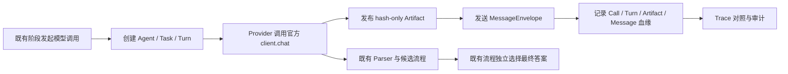

# Phase F2 Agent Protocol 实施报告

日期：2026-08-07
依据：`MATH_AGENT_TRUE_MULTI_AGENT_FINAL_ARCHITECTURE_AND_IMPLEMENTATION_PLAN_2026-08-02.md` 第 29 节

## 结论

Phase F2 已完成，并严格处于 **Shadow Protocol** 迁移阶段。当前既有流程仍是候选生成、验证、仲裁和最终答案选择的唯一权威；新增协议层同步观察既有模型调用并形成结构化 Agent、Task、Turn、Artifact、Message 和 Conversation 数据，不改变数学结果与候选选择。

本阶段没有提前实现 F3 的强制 Router，也没有实现 F4 及以后由 Agent 自主驱动的权威事件循环。因此，F2 完成不等于“真正多 Agent”整体整改全部完成。

## 已实现范围

- `AgentDefinition`：固定七类 LLM 角色的能力、Mode、Task、消息、Artifact 读写权限、动作和 Prompt 合约均为只读定义。
- `AgentInstance`：每次 `solve()` 按 `{session}:{role}:{mode}:{ordinal}` 创建会话级实例，不跨题复用状态。
- `AgentState`：实现 `created / ready / running / waiting_* / completed / abstained / failed / cancelled` 合法状态机，拒绝非法跃迁。
- `AgentTask`：模型 Turn 绑定明确的 Agent、Task 类型和会话，Task 状态及输出 Artifact 可追踪。
- `AgentTurnPayload`：Agent 公开输出统一为版本化、可校验的动作、公开状态增量、结果摘要、出站意图、进度和停止原因。
- `ArtifactEnvelope`：不可变、按规范 JSON 计算稳定 SHA-256，父 Artifact 必须存在于同一会话，读写受 Agent ACL 约束。
- `SessionArtifactStore`：只保存公开结构和模型响应哈希/字符数，不保存原始响应或私有推理。
- `MessageEnvelope` 与 `ConversationThread`：每个成功 Agent Turn 都发布带 Artifact 引用的可见消息；支持语义去重、合法 `reply_to`、参与者校验和关闭后拒绝写入。
- 调用血缘：CallLedger 中每次调用均携带 `agent_id`、`task_id`、`turn_id`；成功调用继续绑定 `output_artifact_id` 和 `message_id`。
- Trace：内部 Trace V2 保留完整 F2 因果快照；Judge Trace 升级到 3.8，公开 Agent 协议摘要和模型调用血缘，不包含 Prompt、原始模型响应、私有推理或异常正文。
- 生命周期：协议运行时与题目会话一同创建；结果构建后清空 Agent、Task、Artifact、Message、Thread 和 Turn 索引，并解除 Budget 引用。

## Shadow Protocol 数据流

关键边界：`G` 和 `I` 不向 `D` 或 `H` 回写决策。

## 验收测试

- Artifact 防御性复制与不可变读取。
- 同一语义 payload 的稳定 SHA-256。
- 父 Artifact 缺失时拒绝发布。
- 跨会话 Agent/Task/Artifact 引用拒绝。
- Agent Artifact 读写 ACL。
- 消息语义去重。
- `reply_to` 必须属于同一 Conversation，且回复必须增加新 Artifact。
- Conversation 关闭后拒绝新消息。
- Agent 非法状态跃迁拒绝。
- 每个成功模型调用均可沿 Call → Agent → Task → Turn → Artifact → Message 重建因果链。
- 三题并发时协议数据无跨 Session 引用。
- 每题结束后会话协议状态已清空。

## 下一阶段边界

F3 应实现强制 Router 协议：每题首个模型调用必须由 `RouterPlanner` 独立完成，并生成权威 `RouteArtifact` 与 `PlanArtifact`。在 F3 验收之前，不能把当前既有 Router 的影子记录误称为已经完成强制 Agent 路由；也不应在 F3 中提前引入 F4 的多 Agent 自主事件循环。
