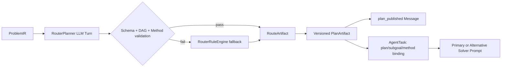

# Phase F3 强制 RouterPlanner 与动态 Plan 实施报告

日期：2026-08-07

## 结论

Phase F3 已完成。Competition、Balanced 与 Safe 三个正式配置都要求每题在任何 Solver 之前独立调用 RouterPlanner。高置信度、低难度或规则可直接分类不再构成跳过 Router 模型调用的理由；`enable_router=false` 仅保留给显式测试与消融配置。

本阶段将 Router 边界切换为权威协议，但候选生成后的多 Agent 自主循环仍由既有流程控制，属于 F4 及后续阶段。

## 已实现

- RouterPlanner 每题执行独立模型调用，使用独立 `agent_id/task_id/turn_id`。
- Router 输出严格包含领域、风险、1–3 个合法方法族、子目标 DAG 和 Agent Task 提议。
- 子目标 ID、依赖引用、环路、Task 类型、Agent 角色、优先级和方法族均经过确定性校验。
- Router 选定的首方法族直接进入 PrimarySolver Prompt，不再被规则默认方法覆盖。
- Solver CallLedger 记录 `plan_id`、`subgoal_ids` 和 `planned_method_family`。
- Router 产生权威 `RouteArtifact`、`PlanArtifact` 和 `plan_published` 消息；Plan Artifact 以 Route Artifact 为父节点。
- Router JSON、Schema、非法方法、DAG 环路、上下文、预算或传输失败时使用 RouterRuleEngine 回退，并在 Trace 中记录安全原因码。
- Replan 产生递增版本和新的 Plan ID，引用父 Plan，并强制保留原始条件摘要、条件文本与已验证事实 ID。
- 同一 Solver 在新 Plan 下创建新 Task，旧 Task 不会被静默复用。
- Router 调用失败或被阻塞后，其 Agent 状态恢复为可再次调度状态。
- Safe 配置由单调用改为至少两次调用容量，避免“强制 Router 后无 Solver 配额”。

## 因果链

## 验收覆盖

- 任意 Solver 调用前存在 Router 调用。
- Router 与 Solver 使用不同 Agent 身份。
- Router 方法族真实改变 Solver Prompt 和任务记录。
- DAG 环路与非法方法拒绝并明确回退。
- Router 失败后规则回退仍可产出答案。
- Router Agent 失败后可再次唤醒。
- Replan 版本递增、父链合法、原始条件与已验证事实不丢失。
- Route/Plan Artifact 和计划消息可从 Trace 重建。
- 正式配置无法关闭 Router 或将题级调用容量压缩到一次。

## 下一阶段边界

F4 将实现 PrimarySolver、AlternativeSolver 与 LemmaCurator 的自主多轮 Action 循环，包括 `continue_reasoning`、Lemma 请求/回复、Tool 请求、停滞检测和 Candidate 发布。本阶段不引入固定六次上限，也不以 Router 完成为理由声称整体真正多 Agent 改造已经结束。
