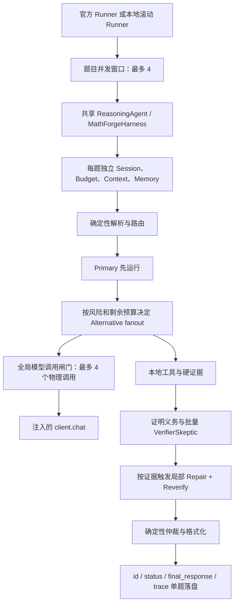

# MathForge 并发、闭环稳定性与奥赛难度就绪度审查报告

日期：2026-07-30  
审查对象：当前工作区中的 MathForge / Math-Agent 全项目  
审查性质：代码静态审查、现有测试验证、最近一次 4 题真实模型 canary 复盘、确定性路由抽样  
配置状态：`config/competition.json` 仍为 `candidate-unvalidated`

## 1. 核心结论

### 1.1 主模型并发与 Harness 并发是否匹配

从代码上看，三层并发上限是一致的：

- 官方入口 `ReasoningAgent` 的题目并发上限为 4；
- 本地逐题运行器的滚动题目并发上限为 4；
- 单个共享 `MathForgeHarness` 内的真实模型物理调用上限为 4。

因此，当前代码不会因为“四道题 × 每题多个候选”而把真实在途模型请求直接放大到 16。每题内部的候选、验证器和修复调用最终都经过同一个全局 `ModelCallGate(4)`。

但是，“代码上限匹配”不等于“服务容量匹配”。最近一次 4 题 canary 中：

- L1、L2 串行预检均成功；
- 4 题并发后共发生 8 次模型调用，仅 3 次完成，5 次发生传输失败；
- 4 题的模型排队等待均小于 0.00005 秒；
- 没有 `model_concurrency_wait_exceeded`；
- 没有后台超时尾调用，也没有物理并发闸门熔断；
- 4 个结果文件全部落盘，3 题得到数学答案且基准符号评分均正确，1 题没有答案；
- 3 个成功结果均因验证器调用失败而被标记为 `degraded`。

这说明最近一次失败不是 Harness 信号量排队造成的，而是请求已经获得调用许可、已经发出后出现了 `network_connect_failure` 或 `network_read_timeout`。当前只能判定“并发 4 下的端到端服务稳定性没有通过”，不能仅凭这一轮数据断言代理、网络、官方服务或并发值中的哪一个是唯一根因。

### 1.2 工作流是否过严，导致所有候选被淘汰

总体结论：不是。

当前证明闭环采用的是 `best_available` 策略：

- 验证器不可用不会直接淘汰普通候选；
- 证明义务未闭合但没有硬失败时，候选会以 `incomplete` 状态降级保留；
- 只有结构/答案契约失败、适用且上下文完整的硬证据明确反驳、证明义务硬失败，或者引理扩展候选缺少规定的复审，才会被淘汰。

最近失败的第 1 题没有进入候选验证阶段。其 Primary 两次调用分别发生连接失败和读取超时，低风险路由又只构造一个候选分支，最终根本没有候选可供验证、比较或仲裁。因此该题失败的直接原因是“候选未生成 + 没有可靠性备用分支”，不是“候选被严格验证全部淘汰”。

不过，项目确实存在几处会在复杂题中造成候选非预期消失或整个闭环回退的严重逻辑缺陷，其中最关键的是高风险题的调用预算重平衡错误。

### 1.3 当前项目能否稳定处理奥赛题

尚不能。

当前框架已经具备多候选、方法多样性、证据、证明义务、批量验证、局部修复、仲裁、Trace 和降级输出的骨架，但奥赛就绪度仍受以下问题限制：

- 英文或隐式表述的奥赛题可能被错误分类到 `general-math`、错误学科或错误答案类型；
- 高风险三候选题在 Primary 使用第二次恢复调用后，后续预算重平衡可能直接抛出异常；
- 验证器看不到完整的 `solution_text`，无法真正复核长证明；
- 所谓交叉审阅目前是“确定性冲突矩阵 + 同一个模型的批量验证角色”，不是候选之间的实质性互审；
- 几何、数论、不等式和组合工具仍很薄，绝大多数关键推理只能依赖同一模型自我验证；
- Skills 是约 1.4 KB 的方法提示和风险清单，不是定理库、策略程序或可执行技能；
- 冻结引理库为空，却在竞赛配置中开启；
- 最大 6 次调用无法同时保证三候选、恢复、验证、修复、复验和引理扩展，需要真正的增量预算规划。

## 2. 当前并发与闭环拓扑



官方入口和本地脚本存在一个差异：

- 官方入口通过 `ReasoningAgent._case_gate` 限制 4 个活跃 `solve()`；
- `scripts/run_case_outputs.py` 直接创建共享 `MathForgeHarness`，由 Benchmark 的滚动线程池限制 4 题；
- 两条路径最终都共享一个模型调用闸门，但本地脚本还有额外的单题墙钟包装线程和运行级熔断器。

## 3. 并发、信号占用与超时审查

| 层级 | 当前实现 | 审查结论 |
|---|---|---|
| 官方题目并发 | `user_agent.py` 中固定为 4 | 与提交目标一致 |
| 本地题目并发 | CLI 限制为 1–4，使用滚动窗口 | 不会一次提交全量题目 |
| 模型物理并发 | 一个共享 `PriorityCallScheduler(4)` | 能保证实际同时调用不超过 4 |
| 每题候选并发 | Primary 完成后，最多并行两个 Alternative | 会在全局闸门排队，不会突破 4 |
| 阶段优先级 | Primary > Verifier > Repair > Alternative > Lemma | 能保护首答案，但可能饿死候选多样性 |
| 模型排队预算 | 每次最多等待 15 秒 | 对 60–165 秒调用而言偏短，压力下易拒绝可选分支 |
| 超时尾调用 | 超时后继续占用物理 permit，直至真实线程结束 | 保证不虚假释放并发，但永久悬挂会使 Harness 长期熔断 |
| 普通连接/读取失败 | 记录为传输失败，但不改变 Provider 健康状态 | 最近 5 次失败后仍显示 `healthy`，健康模型不完整 |
| SIGINT/SIGTERM | 停止提交新题，允许活跃题完成并落盘 | 设计合理，不是最近失败根因 |
| 单题墙钟 | 外层到时返回确定性结果，内部线程为 daemon | 如果内部本地阶段失控，下一题可启动而旧线程仍在运行 |

### 3.1 并发优先级的潜在闭环冲突

当前调度器将 `verifier` 的优先级置于 `alternative` 之前。可能出现以下顺序：

1. 四个 Primary 占满模型并发；
2. 某个较快 Primary 完成并提交 Alternative；
3. 更快结束候选阶段的另一题提交 Verifier；
4. Verifier 越过先排队的 Alternative；
5. Alternative 在 15 秒排队预算内拿不到 permit，被拒绝；
6. 原本的多候选题退化为单候选题。

现有单元测试验证了 Primary 可以越过 Alternative，也验证了物理并发不超过 4，但没有验证：

- Alternative 是否会被连续 Verifier 长期饿死；
- 4 个高风险题并发时是否还能形成计划中的候选数量；
- 15 秒排队预算对 165 秒阶段调用是否合理；
- 阶段优先级在真实延迟分布下是否提高最终正确率。

最近 4 题 canary 均为低风险单候选路径，没有触发 Alternative，因此不能用这轮 canary 证明该风险已经发生，也不能证明它不存在。

### 3.2 普通传输失败没有进入 Provider 健康状态

`ModelCallGate` 的 `healthy/degraded/circuit_open` 目前主要由“已超时但后台仍在运行的尾调用数量”驱动。普通的连接失败和读取超时虽然会写入每题 Budget，却不会更新共享 Provider 健康状态。

因此最近一次运行出现：

- 8 次调用中 5 次失败；
- 所有失败均为已发出的真实请求；
- 每题的 `provider_health_state` 仍为 `healthy`。

这会导致后续阶段无法依据真实传输质量做收紧。例如 Primary 已经经历网络失败后，系统仍可能继续发起低价值 Verifier，额外占用 112–130 秒。

## 4. 候选、交叉验证、证据门禁与仲裁审查

### 4.1 各门禁是否会淘汰候选

| 门禁 | 淘汰条件 | 合理性 | 当前风险 |
|---|---|---|---|
| Candidate Schema | JSON/字段/依赖图等不合法，且恢复失败 | 必要 | 复杂输出更容易触发二次生成 |
| Answer Shape | 答案类型与 ProblemIR 不匹配 | 必要 | ProblemIR 类型误判会误杀正确答案 |
| Hard Evidence | 完整上下文下，适用能力给出硬失败 | 合理 | 工具解析能力和适用边界必须继续做反例测试 |
| Proof Completion | 硬失败才淘汰；未闭合会降级保留 | 不过严 | `complete` 可能仅由同模型软复审产生，名称偏强 |
| Expanded Candidate Review | 引理扩展候选在要求验证器时必须被复审 | 合理 | 验证器不可用会只淘汰扩展候选 |
| Arbitration | 只在已存活候选间按硬失败、覆盖率、一致性等排序 | 合理 | 单候选时没有真正比较 |

### 4.2 低风险路径没有“可靠性候选”

路由策略固定：

- 低风险：1 个候选；
- 中风险：2 个候选；
- 高风险：3 个候选。

`CandidateOrchestrator` 会先根据 `route.candidate_count` 构造分支。低风险题只构造 Primary，后续即使 Primary 完全不可用，Adaptive Fanout 也没有已经构造的 Alternative 可以放行。

最近失败题中，Primary 两次传输失败后仍剩余 4 次全局调用预算，但这些预算不能转化为备用解法。这是当前稳定产出率最直接的逻辑缺口。

### 4.3 交叉审阅不是完整证明互审

当前“候选交叉审阅”实际由两部分组成：

1. Host 构造候选冲突矩阵，比较答案规范化、方法标签、假设集合和未解决义务集合；
2. `VerifierSkeptic` 在一次批量模型调用中审查所有候选。

存在四个限制：

- 冲突矩阵只能发现结构或文本差异，不能证明两个方法真正独立；
- Alternative 为保持独立性看不到 Primary 完整答案，也不会对 Primary 提出针对性反例；
- Verifier 的角色视图明确删除了 `solution_text`，只看到 Claims、自动生成的 MethodSteps 和压缩后的公开步骤；
- Primary、Alternative、Verifier 都使用同一个底层模型，错误具有相关性。

对于长奥赛证明，验证器如果看不到完整公开推导，只能检查摘要化 Claim 图，容易漏掉 Claims 与真实推导之间的断裂。

### 4.4 软验证结果被用于“完整证明”状态

Verifier 证据被标记为 `soft`，但 `proof.obligation_review` 的 `pass` 可以直接满足证明义务，使候选进入 `complete`。这并不等同于形式验证或确定性硬证据。

建议将证明状态拆成至少三轴：

- `hard_evidence_status`：确定性工具是否反驳或支持；
- `proof_coverage_status`：必须证明的义务是否都有公开内容；
- `review_status`：同模型复审为 pass / fail / unknown / unavailable。

只有第一轴达到相应硬证据标准时才使用“deterministically verified”一类描述；同模型软审阅完成应标记为 `reviewed_complete`，不能与形式证明混同。

## 5. 已确认的问题清单

### P0-01 高风险题预算重平衡会否定已经发生的 Primary 恢复调用

严重度：阻断级

初始高风险三候选计划会给 Primary 预留 2 次调用。若 Primary 使用第二次调用完成契约恢复或传输恢复，后续一旦请求修复或“修复 + 复验”，新计划会把 Primary 配额缩为 1。

`CallBudget.set_allocation_plan()` 会检查历史调用数，因 `used_primary=2 > new_primary_limit=1` 抛出：

```text
ValueError: existing primary calls exceed allocation plan
```

这会让已经成功生成候选的高风险题直接进入全局 fallback。奥赛证明更容易触发高风险三候选、长输出恢复和后续验证，因此此问题必须最先修复。

解决方案：

- 预算重平衡必须基于 `used_by_stage` 做增量规划，历史支出不可撤销；
- 新计划的每个阶段上限不得小于该阶段已使用调用数；
- 空间不足时按“未启动的可选工作”回收：Finalizer → Lemma → 第三个 Alternative → 第二个 Alternative；
- 不得通过缩减已消费的 Primary 配额为 Repair 腾位置；
- 增加“Primary 用 2 次 + 高风险三候选 + 触发修复/复验”的回归测试。

### P0-02 低风险题在 Primary 双失败后没有答案生成备用分支

严重度：阻断级

解决方案：

- 区分“正确性 fanout”和“可靠性 fanout”；
- 即使正常路由为单候选，也预构造一个不执行的 reliability Alternative；
- Primary 无候选且仍有时间/调用预算时，强制放行一个不同方法族的 Alternative；
- 该分支的触发条件只能是 Primary 未形成候选，不能因为低置信度随意增加调用；
- 若 Shadow 能精确求解，可先使用 Shadow；Shadow 不支持时再调用可靠性 Alternative。

### P0-03 Provider 健康状态忽略普通传输失败

严重度：阻断级

解决方案：

- 在共享 Provider 层增加有界、线程安全的近期调用结果窗口；
- 分别统计已发出调用的完成率、连接失败率、读取超时率和连续失败数；
- 健康状态不得只由 background tail 决定；
- 当近期传输退化时，停止低价值 Verifier/Lemma/Finalizer，优先保留答案生成和必要的确定性收尾；
- 运行级熔断仍由 Runner 负责，Harness 内只做阶段收紧，不读取 API Key、模型环境变量或私有客户端字段。

### P0-04 并发 4 只有代码约束，没有真实容量标定

严重度：高

解决方案：

- 不立即把并发永久降为 1，也不直接认定并发 4 正确；
- 使用同一组固定题目依次做 concurrency=1、2、4 的 A/B 测试；
- 每个档位至少重复 3 轮，记录调用完成率、排队时间、阶段成功率、p50/p95 延迟和数学正确率；
- 只有并发 4 不显著降低调用成功率时，才冻结为提交配置；
- 若服务对长 Verifier 并发敏感，优先采用阶段感知调度，而不是修改官方注入模型方式。

### P0-05 验证器价值策略没有考虑当前传输退化

严重度：高

最近 3 个已正确生成答案的 canary 用例都额外发起了 Verifier；3 次 Verifier 全部失败，每次额外消耗约 112–130 秒，最终没有改变答案，只把健康状态变为 degraded。

解决方案：

- 先用确定性证据、候选冲突和关键义务计算“本次 Verifier 是否可能改变选择”；
- 单候选、无候选冲突、没有可映射关键 Claim 的义务，不应无条件发起 Verifier；
- Provider 近期传输退化时跳过可选 Verifier，并明确记录 `verifier_skipped_due_to_provider_health`；
- 多候选答案冲突、关键定理条件缺失或高风险证明时，仍保留一次批量 Verifier；
- 不因 Verifier unavailable 淘汰普通候选，维持当前 best-available 行为。

### P1-01 全局阶段优先级可能饿死 Alternative

严重度：高

解决方案：

- 在现有优先级上增加等待时间老化，不能让新 Verifier 无限越过旧 Alternative；
- 为每题的“首个可用答案”保持最高优先级；
- 在高风险题已经有一个候选后，至少保障一个独立 Alternative 获得有限等待机会；
- 增加 4 个高风险题并发、长 Primary、短/长 Verifier 混合的确定性调度测试；
- 验收应检查实际生成候选数，而不只检查物理并发峰值。

### P1-02 单题墙钟返回后可能残留 Harness 工作线程

严重度：高

本地 `PerCaseWallClockRunner` 超时后会返回结果，但不能终止内部 daemon 线程。Benchmark 随后可以补入下一题。模型闸门仍能保护物理模型并发，但失控的本地解析、工具或格式化阶段可能继续占用 CPU/内存。

解决方案：

- 为 Session 增加合作式取消标志；
- 外层墙钟到达时设置取消标志；
- 每个大阶段、工具调用前、候选扩展前检查取消状态；
- 禁止超时 Session 再提交新模型或工具工作；
- 修正超时文案中“20 分钟”与当前 900 秒配置不一致的问题。

### P1-03 Verifier 看不到完整公开解答

严重度：高

解决方案：

- 允许 Verifier 看见受长度约束的完整 `solution_text`，而不是完全删除；
- 压缩时优先保留：题目条件、完整核心证明、关键 Claims、依赖关系、义务和反证信息；
- 若完整解答超预算，应生成可追溯的段落摘要，并保留原段落哈希和 Claim 映射；
- 增加“公开步骤正确但 solution_text 中存在跳步/错误”的反例测试。

### P1-04 同模型软复审的 `complete` 语义过强

严重度：高

解决方案：

- 使用多轴验证状态；
- 仲裁中继续允许 best-available，但 Trace 必须区分硬验证、软复审和未验证；
- `status=success` 可以保留给已产生答案的题，但闭环健康中必须明确 `reviewed_only` 或 `proof_incomplete`；
- 评测报告分别统计答案产出率、答案正确率、硬证据覆盖率和软审阅覆盖率。

### P1-05 奥赛题 ProblemIR 与路由存在系统性误判

严重度：高

确定性抽样结果：

- 英文不等式证明被路由为 `general-math`；
- “Determine all positive integers n such that ...” 被解析为 calculation/expression，而不是整数解集或证明；
- 红蓝染色单色三角形问题被路由为 geometry，而不是 combinatorics；
- 典型几何证明仅判为 medium risk；
- 当前 88 题测试集被路由为 77 个 low、11 个 medium、0 个 high，因此现有简单集几乎没有覆盖奥赛高风险路径。

解决方案：

- 扩展意图识别：`determine all`、`classify`、`find all integers`、染色、图、极值、不等式符号、整除动词等；
- 将答案类型与题目目标解耦，支持证明题中仍有 set/integer/expression 型最终结论；
- 增加奥赛难度特征：隐式构造、非标准目标、多个量词、全称不等式、Diophantine、染色/不变量、圆幂/共线共圆等；
- 维护带人工标签的路由基准，而不是只依赖当前 88 题；
- 竞赛配置可以继续关闭 LLM Router，但规则 Router 必须先达到可测的召回率。

### P1-06 最大 6 次调用的预算模型不能覆盖所有复杂闭环

严重度：高

高风险题可能同时需要：

- Primary；
- Primary 契约或传输恢复；
- 两个 Alternative；
- 一次批量 Verifier；
- 一次 Repair；
- 一次 Reverify；
- 一次 Lemma-guided expansion。

这些阶段不可能全部在 6 次内完成。当前问题不是单纯把 `max_model_calls` 调大，而是没有清晰的互斥优先级。

解决方案：

- 保持最大调用数为一个明确、可评测的上限；
- 使用“已消费 + 必须保留 + 可选机会成本”的增量规划；
- 建议 6 次调用下的奥赛默认序列：
  1. Primary；
  2. 第一独立 Alternative；
  3. 第二 Alternative 或 Primary 恢复，二者按实际事件互斥；
  4. 一次批量交叉审阅；
  5–6. 仅在存在可操作失败时组成原子的 Repair + Reverify；
- 如果没有修复触发，剩余调用才用于 Lemma 扩展；
- Finalizer 保持关闭，最终格式化继续确定性执行。

### P1-07 本地工具不足以支撑奥赛硬验证

严重度：高

当前工具主要覆盖表达式解析、符号等价、简化、数值残差、矩阵形状、概率密度归一化、小规模枚举和格式检查。

缺少：

- 几何构型、共线/共圆、定向角和退化条件验证；
- 数论同余、估值、gcd/互素条件与有限范围反例搜索；
- 不等式域约束、等号条件、SOS/因式分解证书；
- 组合对象的图结构枚举、染色反例和递推基例验证；
- 证明中量词、方向和依赖闭合的结构检查。

解决方案：

- 只增加可明确限定输入和能力边界的确定性工具；
- 工具失败只有在输入完整、上下文完整、能力与 ClaimKind 匹配时才能成为致命硬证据；
- 每个新工具必须有反例、退化条件、超时和不适用测试；
- 不把数值抽样升级为普遍命题证明。

### P1-08 冻结引理库为空却被启用

严重度：中高

当前 manifest 的 `record_count` 为 0，但竞赛配置开启了 `enable_frozen_lemma_store`。这不会直接导致错误，却造成“记忆已经接入并在发挥作用”的假象。

此外，未来有内容时，当前前提检查主要依赖归一化字符串包含关系，不足以证明复杂数学前提成立。

解决方案：

- 在库为空时关闭该功能，或启动时明确标记 `enabled_but_empty`；
- 在装入真实引理前，将前提检查升级为结构化域/假设匹配；
- 冻结库只允许离线人工审核和哈希固定，评测期间只读；
- Trace 区分“检索命中”和“前提已验证”，不能把文本命中视为可用定理。

### P1-09 当前引理闭环不是独立引理发现器

严重度：中高

`LemmaCurator` 只是把现有 Candidate Claims 转成 LemmaCard；`LemmaVerifier` 主要依据已有证据确认这些 Claim。它能够整理和复用已验证局部结论，但不能独立发现关键辅助构造，也不能证明模型未证明的新引理。

解决方案：

- 保留当前确定性 Curator 作为可信整理层；
- 将“引理发现”明确作为一次受预算约束的候选扩展策略，而非宣称已有独立证明能力；
- 引理扩展必须显示其来源 Claim、验证证据和下游使用位置；
- 对奥赛题增加“关键构造/关键引理缺失”检测，只有确实卡在局部义务时才使用该调用。

### P1-10 Prompt 与 Token 配置的实际生效值不透明

严重度：中高

虽然竞赛配置设置 `primary_max_tokens=65536`，但：

- Primary 阶段上限为 32768；
- PromptCompiler 对所有 Solver profile 又限制为 8192 输出 token；
- 核心协议还明确要求在 8192 token 内完成；
- Primary 角色上下文视图实际预算约为角色合同的一半，即约 12000 字符；
- Verifier 视图约为 20000 字符，并且删除完整 `solution_text`。

因此 65536 并不是实际单次 Solver 输出能力。多层上限本身可以合理，但当前配置名和 Trace 不足以让使用者快速知道真正限制。

解决方案：

- 在启动 manifest 和每次调用记录中输出 `configured → stage cap → compiler cap → context allocation`；
- 为 proof profile 单独标定输出上限，不要让所有 profile 固定相同值；
- 不盲目追求长输出，优先保证完整 Candidate JSON、关键证明和最终答案；
- 对奥赛长证明做截断恢复测试，验证 8192 token 是否足够，再决定是否提高。

### P1-11 “结果文件稳定”与“数学答案稳定”尚未分开

严重度：中高

当前 fallback 能保证非空 `final_response` 和完整 Trace，因此文件产出很稳定；但 fallback 内容不是数学答案。最近 canary 的文件覆盖率为 100%，答案产出率和正确率为 75%。

解决方案：

- 分别定义并统计：
  - artifact completion rate；
  - answer-bearing rate；
  - scoreable rate；
  - mathematical correctness；
  - healthy closed-loop rate；
- 禁止用“文件成功落盘”替代“题目成功求解”；
- `status=failed` 的 fallback 保持非空，但不能被计入答案产出成功。

### P1-12 Phase7 辅助剖析脚本的答案匹配口径不可靠

严重度：中

辅助 profile 使用字符串规范化比较时，将两个 LaTeX 等价答案判为不匹配，得到 1/3 的错误匹配率；正式 benchmark 的符号评分正确识别为 3/3。

解决方案：

- 运行剖析必须复用 `mathforge.evaluation.scoring` 的正式评分结果；
- profile 不应自行实现弱化版答案等价；
- 历史运行比较必须同时校验数据集、配置、模型标识和执行题号范围。

### P2-01 超时文案与 15 分钟配置不一致

严重度：低

本地单题超时提示仍写“20 分钟”，当前竞赛配置外层限制为 900 秒。该问题不改变运行结果，但会误导定位。

解决方案：从实际配置渲染文案，并增加配置一致性测试。

## 6. 面向稳定结果产出的推荐闭环

### 6.1 简单题

1. 确定性解析、Shadow probe 和路由；
2. Primary 生成完整候选；
3. Primary 无候选时立即启动 reliability Alternative；
4. 执行答案形状和适用的确定性硬检查；
5. 无冲突且无关键证明义务时直接确定性格式化；
6. 有关键义务时，仅在 Provider 健康且 Verifier 可能改变结论时调用一次批量审阅；
7. Verifier 不可用时保留非硬失败候选，Trace 标记降级。

### 6.2 中高难度题

1. 路由输出学科、题型、答案类型、风险、方法族和预算画像；
2. 至少生成两个方法实质不同的候选；
3. 对答案和关键 Claim 做确定性工具检查；
4. 构建候选等价簇、分歧矩阵和证明义务；
5. Verifier 获取完整公开核心解答，在一个批量调用中：
   - 指出候选间的具体矛盾；
   - 检查定理条件；
   - 给出 Claim-local fail/unknown/pass；
6. 只对可操作 fail 做一次局部 Repair；
7. Repair 必须和 Reverify 作为不可拆分的两次调用预算；
8. 仲裁优先级为：
   - 无适用硬失败；
   - 证明覆盖更高；
   - 独立方法答案一致；
   - 软审阅更好；
   - 稳定生成顺序打破完全平局；
9. 始终输出最佳未被反驳候选，同时诚实标记验证等级。

### 6.3 奥赛题专用策略

#### 不等式

- 候选方法族至少覆盖代数变换、凸性/经典不等式、齐次化/代换或极值；
- 检查变量域、分母、等号条件和边界；
- 能生成 SOS/因式分解证书时使用硬证据，否则保持软审阅。

#### 几何

- Synthetic、coordinate、vector/complex 中选择至少两种；
- 明确定向角、点序、共线/共圆和退化情况；
- 坐标候选可进入符号验证，纯综合证明由完整公开推导 + 交叉审阅处理。

#### 数论

- Congruence、valuation/factorization、descent/extremal 至少两种；
- Host 检查整数域、互素、模逆合法性和小范围反例；
- “求所有整数”必须解析为完备解集任务，验证必要性与充分性。

#### 组合

- 区分计数、图论染色、不变量、极值和递推；
- 小规模枚举只用于找反例和校验基例；
- 证明必须说明对象、分割互斥性、是否重计以及归纳/递推基例。

## 7. 分阶段整改实施计划

### 阶段 A：修复确定性闭环阻断

任务：

- 修复 P0-01 的预算重平衡；
- 增加低风险 reliability Alternative；
- 为共享 Provider 增加普通传输失败健康窗口；
- 修正超时文案。

验收：

- Primary 已用 2 次时，任何重平衡均不抛错；
- 低风险 Primary 双失败、Shadow 不支持时，至少尝试一个不同方法族；
- 普通连接/读取失败能使 Provider 状态进入 degraded；
- 既有并发、基线文件和公共输出契约测试全部通过。

### 阶段 B：收紧并发调度，但保持候选多样性

任务：

- 为阶段优先级增加老化/公平性；
- 增加高风险四题并发测试；
- 增加合作式取消；
- 增加 concurrency=1/2/4 校准工具和相同题集重复协议。

验收：

- 物理模型并发峰值永不超过 4；
- 无永久 Alternative 饥饿；
- 计划为 2/3 候选且预算允许时，实际候选生成数达到计划；
- 超时 Session 不再提交新模型或工具工作。

### 阶段 C：重构交叉审阅和证明状态

任务：

- Verifier 获取完整受限公开推导；
- 区分硬证据、证明覆盖和软审阅；
- Verifier 采用价值门控；
- 候选冲突时生成 Claim-local 交叉审阅；
- 保留 best-available，但消除“软审阅等同完全验证”的语义。

验收：

- Verifier 能发现只存在于 `solution_text` 的错误；
- Verifier unavailable 不淘汰普通非硬失败候选；
- 单候选低价值验证可被确定性跳过；
- 多候选冲突必须进入一次批量交叉审阅；
- Trace 能解释每个候选为何保留、淘汰或被选中。

### 阶段 D：奥赛路由、Skills、工具与记忆

任务：

- 建立人工标注的奥赛路由集；
- 修复题型、答案类型和学科识别；
- 扩充奥赛方法策略，而不只是关键词；
- 增加有严格能力边界的几何/数论/不等式/组合检查；
- 空冻结引理库关闭；非空前升级前提验证；
- 将引理整理与引理发现明确分层。

验收：

- 人工标注学科和答案类型召回率达到预先冻结阈值；
- 四大奥赛域每类至少有路由、候选多样性和反例测试；
- 不适用工具不会产生致命硬失败；
- 冻结引理只有前提结构化匹配后才能注入；
- 评测期间无跨题写入和数据污染。

### 阶段 E：真实模型分级验收

顺序：

1. 4 题 canary：并发 1、2、4 各重复至少 3 次；
2. 16 题：覆盖 low/medium/high 和四个奥赛域；
3. 88 题完整简单集；
4. 独立奥赛集，采用人工证明评分。

硬性停止条件：

- 发生预算重平衡异常；
- 结果文件缺失或公共字段不合规；
- 模型物理并发超过 4；
- 出现跨题上下文污染；
- 配置、模型请求标识或数据集哈希不一致；
- 4 题 canary 的模型调用成功率未达到冻结门槛。

建议冻结门槛：

- 结果文件覆盖率：100%；
- 公共 JSON 合规率：100%；
- 模型物理并发越界：0；
- Queue admission rejection：0，或有明确的可选分支降级解释；
- 简单集答案产出率与正确率：先达到不少于当前最佳历史值，再要求连续多轮稳定；
- Provider 调用成功率：完整运行达到至少 98% 后才能标记 validated；
- 奥赛集不使用简单集的 98% 正确率目标，先冻结人工评分基线，再以相对提升和证明有效率验收。

## 8. 不建议立即执行的改动

- 不依据一次网络失败直接永久降低 `model_max_concurrency`；
- 不把模型 ID 改为依赖环境变量；官方入口仍应只使用注入的 `client.chat`；
- 不增加新的在线客户端、API Key 读取或模型私有字段访问；
- 不为了让状态变成 success 而绕过 Candidate Schema、答案形状或适用硬证据；
- 不把 Verifier unknown/unavailable 当作候选错误；
- 不简单把 `max_model_calls` 大幅提高来掩盖预算规划错误；
- 不在冻结引理库为空且前提检查薄弱时填入未经审核的跨题内容。

## 9. 本次审查验证记录

- 并发、生命周期、候选编排、闭环、Shadow、Cache、Deadline 和输出恢复相关定向测试：47 项通过；
- 复现了高风险 Primary 已用 2 次后重平衡到 Primary=1 的确定性异常；
- 对当前 88 题路由统计：
  - low：77；
  - medium：11；
  - high：0；
  - 单候选：77；
  - 双候选：11；
- 对典型奥赛题做了确定性路由抽样，确认不等式、数论目标和组合染色存在误分类；
- 最近 4 题真实模型 canary：
  - 文件落盘：4/4；
  - 数学答案：3/4；
  - 正确答案：3/4；
  - 健康闭环：0/4；
  - 已发出模型调用完成：3/8；
  - 模型排队拒绝：0；
  - 后台尾调用：0。

## 10. 最终判断

当前 Harness 的总体方向是合理的：共享客户端、每题隔离、全局物理并发闸门、硬证据优先、局部修复、确定性仲裁和稳定落盘都值得保留。

当前最主要的问题不是“验证过严”，而是：

1. 服务调用失败后没有把剩余预算转换成新的答案生成机会；
2. Provider 健康模型看不到普通传输退化；
3. 高风险预算重平衡可能否定历史支出并直接终止闭环；
4. 全局调度在压力下可能牺牲候选多样性；
5. 交叉审阅看不到完整证明，且仍是同模型自审；
6. 路由、工具、Skills 和记忆尚不足以支撑奥赛级稳定正确率。

整改顺序必须先保证“至少形成一个候选并且闭环不会因预算自身崩溃”，再优化验证深度和奥赛能力。否则继续增加验证器、修复器或候选数量，只会增加调用占用和失败面，不能提高稳定结果产出。
