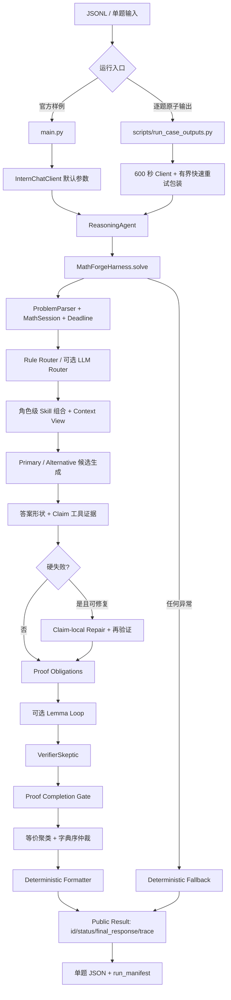

# Math-Agent 全项目架构审查、缺陷汇总、解决方案与实施计划

日期：2026-07-25
审查基线：Git `1a9b10c7d44c3a641972d79ff5e4936829af90fa`
审查对象：257 个受控文件、当前 Competition 配置、329 项离线测试、最近多轮
Intern-S2-Preview-397B 实测产物
结论状态：**工程骨架成立，但当前不能冻结为可稳定参赛的 Competition 版本**

## 1. 执行结论

当前项目仍然是数学 Agent。更准确地说，它是一个由确定性 Host 编排的
“固定角色 Agentic Pipeline”，不是多个自治 Agent 自由对话、共享任务和自行调用
工具的开放式 Multi-Agent 系统。

固定的模型角色包括：

- `RouterPlanner`
- `PrimarySolver`
- `AlternativeSolver`
- `VerifierSkeptic`
- `RepairAgent`
- 可选 `LLMFinalizer`

`LemmaCurator` 虽保留角色名和 Prompt Contract，但生产路径是确定性 Host 服务，
不发起模型调用。解析、预算、状态机、上下文、记忆、检索、工具、证据、证明义务、
修复事务、仲裁、格式化、Trace 和 Fallback 都由确定性组件控制。

这个基本方向是合理的：数学正确性不能完全依赖模型自评，固定角色和确定性证据门
也比自由式 Agent 群更适合比赛的时限、可复现性和安全边界。但当前实现仍有四个
阻断项：

1. **模型调用路径不统一。** 官方不可变 `main.py`、官方不可变 `llm_client.py`
   与 `scripts/run_case_outputs.py` 使用不同的并发、超时、重试、模型默认值和输出
   契约；本地测试成功不等于官方入口成功。
2. **Intern 服务正式请求不稳定。** 精确模型字段已经校正为
   `intern-s2-preview-397b`，且历史上存在成功的正式调用；但最近出现预检成功、
   正式数学请求零输出或连接失败的情况。这不是单纯的模型 ID 错误。
3. **Prompt/证据闭环过重且部分失配。** 简单题也要求完整 Candidate JSON、
   MethodStep、Claim、定理和义务；工具参数依赖模型生成特定文本形式，却没有把
   所需 DSL 充分教给模型。大量“验证”最终是 `unknown`，但仍产生延迟和复杂度。
4. **Competition 尚无有效冻结证据。** 配置仍是 `candidate-unvalidated`，
   内容审核仍是 `pending-human`；旧 88 题结果来自旧 Commit/旧 Schema，且大量
   `final_response` 是 JSON 泄漏或截断，不能代表当前 Harness 的有效准确率。

离线质量门目前良好：`python -m compileall .` 通过，`pytest -q` 为
`329 passed`。但这些测试主要使用注入式 Fake Client，证明的是工程契约，不证明
Intern 397B 服务当前可用，也不证明完整 88 题正确率。

## 2. 审查范围与证据

### 2.1 已检查的对象

- 冻结入口：`main.py`、`llm_client.py`
- 公共入口：`user_agent.py`
- 核心编排：`mathforge/runtime.py`
- 角色、Prompt、Skill、Context、Memory、RAG、Tool、Evidence、Obligation、
  Arbitration、Repair、Trace、Output、Benchmark、Governance
- `safe`、`balanced`、`competition` 和 A0–A10 消融配置
- 29 个领域 Skill、6 个通用 Skill、7 个 Prompt Contract
- 53 个测试文件
- 88 题旧完整输出及最近中止复测产物

### 2.2 实测证据

| 证据 | 观察 | 能证明什么 |
|---|---|---|
| 当前离线测试 | 329 项全部通过 | 本地结构、Schema、线程隔离和模拟失败路径基本可用 |
| 历史精确 397B 成功调用 | 正式模型调用约 85.15 秒，严格 JSON，答案 `-1/4` 正确 | 精确小写模型字段和当前 API 路径至少曾经可调用 |
| 最近复测 case 0 | 预检成功；正式请求 239.39 秒后失败；输出 Token 为 0 | ID/鉴权/网络握手并非全部失效，正式生成阶段失败 |
| 最近复测 case 1 | 正式请求约 3.41 秒快速失败；输出 Token 为 0 | 服务还存在快速拒绝或连接类失败 |
| 其他诊断请求 | 曾在约 126.6、158.9、170.9、300.4 秒失败 | 故障时长不固定，不能用单一超时值解释 |
| 旧 88 题目录 | 当前评分 36/88；32 个 `invalid_actual_syntax` | 40.91% 主要反映旧输出管线损坏，不是纯模型数学能力 |

旧 88 题结果不能作为当前版本基线，原因包括：

- 产物来自旧 Commit `5089318...` 和 Trace/Config Schema 1.1；
- 顶层没有 `status`；
- 多个 `final_response` 直接包含截断 JSON、重复 JSON 或说明性文本；
- 使用过大小写不同的展示字段；
- 当前评分中 32 题因最终答案解析为 `{` 等语法错误而失败。

因此，当前没有可用于“新旧准确率提升”判断的同版本、同配置、同模型、同服务状态
的完整对照实验。

## 3. 当前架构与真实运行闭环



### 3.1 闭环是否完整

从结构上看，闭环是完整的：

1. 输入被规范化并解析成 `ProblemIR`；
2. Router 决定领域、风险、方法族、Skill 和 Tool；
3. 角色 Context 通过权限和字符预算构造；
4. 生成一个或多个候选；
5. Host 对答案形状和 Claims 建立 Evidence；
6. 硬失败触发局部 Repair；
7. 证明题生成 Proof Obligations；
8. 高风险证明可进入 Lemma Loop；
9. Verifier 对公开 Claims 和义务进行质疑；
10. Proof Completion Gate 拦截未完成证明；
11. 候选按硬证据、义务覆盖、答案一致性、独立方法和软证据仲裁；
12. 确定性格式化并输出公共 Trace；
13. 失败路径生成非空 Fallback 和终态。

但闭环“结构存在”不等于“质量有效”。当前主要断点是：

- 模型请求可能在候选生成前失败；
- 工具经常无法从自然语言 Claim 重建参数；
- 低风险计算题可以在所有 Claim 均为 `unknown` 时直接被接受；
- 证明题又可能因 Verifier 不可用或 Claim 类型未映射而全部回退；
- 官方入口和自定义运行器没有相同的生命周期与输出语义。

### 3.2 架构类型判断

| 判断项 | 当前结论 |
|---|---|
| 是否为数学 Agent | 是 |
| 是否为开放式自治 Multi-Agent | 否 |
| 是否有多个固定 LLM 角色 | 是 |
| 角色之间是否直接对话 | 否，由 Host 传递受控结构 |
| 是否支持原生函数调用 | 否 |
| 工具由谁执行 | Host 根据 Claim 建议重建参数后执行 |
| 是否有长期记忆 | 否 |
| 是否有题内工作记忆 | 是 |
| Skill 是否可执行 | 否，本质是路由后注入的静态 Markdown 指导 |
| RAG 是否接入 | 实现存在，Competition 默认关闭 |
| MCP 是否接入 | 实现存在，Competition 默认关闭 |

固定角色 + 确定性服务的架构可以保留，但应把“多 Agent”“动态 Skill”“Memory
已接入”分别表述为“固定角色流水线”“静态注册表的动态选择”“题内会话记忆”，
避免能力宣传超过真实实现。

## 4. 模型调用专项根因审查

### 4.1 已排除的单一根因

不能再把失败简单归因于“模型字段写错”。当前代码要求的精确字段是
`intern-s2-preview-397b`，与官方说明一致；该字段也曾成功完成正式数学请求。
当前故障是多因素叠加。

### 4.2 从终端到服务端的故障链

| 层级 | 当前问题 | 现象 |
|---|---|---|
| PowerShell 启动 | API Key 若不加引号赋给 `$env:INTERN_API_KEY`，会被解释为命令 | 请求根本不会开始 |
| 模型身份门 | 大写 `397B`、Legacy 别名或未设置 `INTERN_MODEL` 会 fail closed | 初始化阶段直接失败 |
| 官方 Client 默认值 | `llm_client.py` 默认模型是 Legacy `intern-s2-preview`，默认 timeout=120、retry=3 | 使用官方 `main.py` 时与本地修复路径不同 |
| 官方入口并发 | `main.py` 默认启动 8 题，Harness 模型 Gate 却是 1 | 题目在队列中消耗自己的 15 分钟 Deadline |
| 自定义 runner 并发 | `run_case_outputs.py` 默认 concurrency=4，但底层模型请求被串行化 | 同样存在多题同时计时、单路服务排队 |
| 预检 | 只要求模型回复 `OK`，不验证长系统 Prompt、严格 JSON和数学内容 | 预检成功后正式请求仍可失败 |
| Completion 请求 | Competition 对所有角色统一申请最多 65,536 Token | 对简单题过大，可能放大调度成本；但 8K 诊断也失败，所以不是唯一根因 |
| 重试 | Runner 只对 180 秒内返回的异常重试；第二次请求不感知 Harness 剩余时间 | 重试可能成为后台尾调用 |
| Deadline | Host 超时只能停止等待，不能取消 `requests.post` 或服务端生成 | 线程继续占用 Gate，进程停止后远端请求也未必立即取消 |
| 错误可观测性 | 公共 Trace 只保留 `model_call_failed`，默认也没有 Debug Sink | 无法区分 DNS、TLS、HTTP 状态、限流、读取超时、JSON 响应错误 |
| 模型身份回传 | 官方 `client.chat` 只返回文本 | 只能证明请求字段，不能证明服务端实际 `ref_model` |
| 服务端 | 预检成功、正式请求在 3–300 秒不等时失败并且零输出 | 高概率存在服务负载、限流、网关或长生成链路不稳定 |

### 4.3 为什么 `final_response` 会异常

当前版本在模型没有返回候选时，会安全地返回固定 Fallback，而不是伪造答案；这也是
最近输出中出现 “model call was unavailable” 的直接原因。旧版本的异常
`final_response` 则主要来自另一条链：

1. 模型没有严格遵循 JSON Contract；
2. `SolutionParser` 从外层文本中提取到不完整或错误 JSON；
3. 旧 Formatter 把整段 JSON 或截断字段当成最终答案；
4. 结果再次追加 `Final answer:`，形成重复或泄漏。

当前 Parser/Formatter 已增加严格 JSON、别名、截断分类和规范化，但尚未在稳定的
397B 全量测试上证明旧问题已经真正消失。

### 4.4 模型调用问题的最终判断

当前模型调用问题由以下三部分共同构成：

- **外部主要原因：** Intern 正式生成请求当前不稳定；
- **内部放大原因：** 入口、并发、超时、重试和预检策略不一致；
- **诊断缺口：** 项目把不同 Provider 异常统一折叠，无法用现有产物精确定位服务端
  返回了什么。

所以结论不是“已经完全解决”，而是“模型 ID 和 Harness 基础调用链已修正，但稳定
调用与可诊断性尚未解决”。

## 5. Prompt、Context、Memory、Skills、Tools 与 Trace 审查

### 5.1 Prompt

优点：

- 七个角色均有版本化 Contract；
- Solver 明确要求公开可核验步骤而非私有思维草稿；
- Host-owned 字段、工具调用和输出 Schema 边界较清楚；
- Alternative 只收到主方法标签，不收到主解全文；
- Verifier 不收到 Solver 的 `solution_text`。

问题：

1. 简单计算题也要输出完整 JSON、Claims、MethodSteps、Theorems 和
   Obligations，协议成本高。
2. Contract、运行时指令、Skill 和 Context 有重复信息，实测简单题 Prompt 已约
   9.5K 字符。
3. 所有角色共用 `primary_max_tokens=65536`，Router、Verifier、Repair 并不需要
   同样的输出上限。
4. 20 题 Prompt Probe 主要是 Fake Client 契约夹具；真实 397B Probe 尚无稳定
   验收结果。
5. `outer_json`、`repaired_json` 等宽容解析会提高可用性，也会掩盖 Prompt
   违约；当前只记录 deviation，没有按风险决定是否拒绝。
6. Prompt 没有教授 `density_normalization` 和 `small_case_enumeration` 所需的
   精确 Claim DSL，工具多数无法被真正触发。

### 5.2 Context

优点：

- 每题独立 `MathSession`；
- 每个角色有权限化 Context View；
- 压缩会保留原条件、最终答案、硬证据和必需义务；
- Alternative、Verifier、Repair 的视图有显式裁剪；
- 总模型上下文按 262,144 Token、8,192 安全余量进行门控。

问题：

1. 本地没有匹配哈希的官方 Tokenizer 时使用 UTF-8 字节上界；它安全但严重保守，
   中文和数学 Unicode 的预算偏差较大。
2. Prompt Contract 先按字符限制，再按 Token 限制，存在双重且语义不同的预算。
3. Context Snapshot 和 Blackboard 中会重复存储路由或证据摘要，增加 Prompt。
4. `raw_context_ref` 只在题内可解析，对公开 Trace 或后续恢复没有意义。
5. 只校验 `final_response` 不超过模型窗口；无限 Trace 可能使整个 JSON 产物远大于
   256K。若“单次回答不超过 256K”指整个公共 JSON，当前实现不满足。

### 5.3 Memory

当前“Memory”仅是：

- 每题独立的 `SessionMemory`；
- 角色权限化 `MemoryBlackboard`；
- 只允许 verified Lemma 进入题内 `LemmaMemory`。

它不是跨题长期记忆，也没有读写外部向量库、经验库或用户画像。RAG 数据库可以视为
只读知识库，但默认关闭，且不是运行学习产生的记忆。因此：

- 题内隔离和防污染设计正确；
- `enable_memory=true` 容易让使用者误解为长期记忆已接入；
- 没有跨题收益，也不会在测试中在线学习；
- 应重命名为 `enable_session_memory`，长期只读知识另设明确配置。

### 5.4 Skills

当前 35 个 Skill 是结构化 Markdown 指导文件。`SkillRegistry` 在
`ReasoningAgent` 初始化时一次性扫描并校验，之后按 Router 结果进行角色级拼接。

优点：

- 有版本、角色、触发词、强制章节和内容指纹；
- 每个角色按 6,000 字符预算整块注入，不会截断半个 Skill；
- Trace 记录选择、遗漏和未知项。

问题：

1. Frontmatter 的 `triggers` 没有驱动运行时检索；真正路由仍由
   `router_planner.py` 的硬编码 `_SUBJECT_SIGNALS` 决定。
2. 新增 Skill 文件并不会自动获得路由能力，还必须同步修改领域信号、方法族和测试。
3. Agent 初始化后不热加载；这是可复现性上的优点，但不是运行时动态发现。
4. `differential-equations` 与 ODE/PDE、`real-analysis` 与
   `advanced-real-analysis`、两套 linear algebra 存在边界重叠。
5. 所有 Skill 都经过工程审核，但没有人类数学专家签名。
6. Skill 只影响 Prompt，不会直接注册代码工具或执行工作流。

### 5.5 Tools 与 Evidence

当前注册 9 个本地工具：

- `safe_parse_expression`
- `symbolic_equivalence`
- `simplify_expression`
- `numerical_residual`
- `matrix_shape_check`
- `density_normalization`
- `small_case_enumeration`
- `latex_syntax_check`
- `answer_type_check`

优点：

- 受限 AST，避免任意代码执行；
- 高风险 SymPy 工具通过子进程隔离；
- 有 Capability、Strength、状态和可重现参数摘要；
- Timeout 归为 `unknown` 而非假定失败；
- MCP 默认关闭，Direct 是可控默认。

问题：

1. `ClaimEvidenceVerifier` 从 Claim 自然语言中拆 `=` 或把整段 statement 当表达式，
   参数重建成功率低。
2. 实测成功题 5 个 Claims 中 4 个为 `unknown`、1 个 Tool `error`，说明工具闭环
   没有提供与复杂度相称的验证价值。
3. `density_normalization` 和 `small_case_enumeration` 需要未在 Prompt 中说明的
   专用文本 DSL。
4. `answer_type_check` 的 fraction/vector/matrix 等正则过窄；合法 LaTeX 可能被
   当作硬失败。
5. 硬证据门目前按任何 active hard fail 拒绝候选，而不是只按能验证相关数学 Claim
   的 Capability 拒绝；语法/形状误判可能淘汰数学正确候选。
6. `simplify_expression` 对完整自然语言 Claim 调用时容易进入 Tool error。
7. 每个隔离 Tool 单独启动 Python 进程，Claims 多时开销明显。
8. 没有统一统计“被选择但从未成功构造参数”的工具，现有 Tool 数量会高估能力。

### 5.6 Trace

优点：

- Trace 2.0 有连续序号、阶段、单调时间和终态校验；
- 候选公开步骤、Claims、Evidence、Repair、Lemma、仲裁和最终选择可追踪；
- 不输出 API Key、原始异常、绝对路径或私有 Chain-of-Thought；
- 失败时不伪造候选推理链。

问题：

1. `trace_max_chars=0` 和 `trace_max_events=0` 意味着无限制；候选多、Claims 多、
   Repair/Lemma 多时会占用大量内存和磁盘。
2. Trace 是 solve 结束时整体构造，不是事件流式持久化；进程崩溃会丢失本题尚未
   返回的全部内部过程。
3. 公共 Trace 为安全而折叠 Provider 异常，但默认没有开启私有 Debug Sink，导致
   真正故障无处可查。
4. `final_answer_selected` 同时保存 solution、steps、answer 和 formatted response，
   与候选事件存在较多重复。
5. 用户要求的“推理链”应定义为公开可核验推导，而不是模型私有思维过程；当前安全
   边界是正确的，应在验收标准中固定。

## 6. 全部问题分级

### 6.1 S0：阻断正式测试或可能产生错误状态

| ID | 问题 | 影响 | 解决方向 |
|---|---|---|---|
| S0-01 | 官方 `main.py` 与自定义 runner 行为不一致 | 本地通过不能代表提交入口 | 建立入口等价测试；若官方确实执行 `main.py`，需主办方允许更新冻结基线或提供注入参数 |
| S0-02 | `main.py` 输出 `idx`，且把任何非空 Agent 结果重写为 `success` | Fallback 可被伪装为成功，违背四字段契约 | 不可在当前不可变约束内彻底修；必须明确评测实际入口并取得变更授权 |
| S0-03 | `main.py` 异常输出额外 `error` 和原始消息 | 契约漂移及异常泄漏 | 同上；公共输出必须统一由 `build_public_result` 产生 |
| S0-04 | 官方 Client 默认 Legacy 模型、120 秒×3 次重试 | 397B 长请求被提前截断 | 评测入口必须显式注入小写精确模型和合理 Client 参数 |
| S0-05 | 题级并发大于模型并发，排队仍计入每题 Deadline | 后排题未调用模型就超时 | Competition runner 强制 `concurrency=1`，或把 Deadline 从取得模型槽位后开始并设置全局调度器 |
| S0-06 | Provider 正式请求不稳定且无错误分类 | 预检成功仍批量失败 | 增加私有 Transport 诊断、代表性 Canary 和熔断器；服务恢复前禁止 88 题 |
| S0-07 | Host 超时不能取消 HTTP/服务端生成 | 后台尾调用占槽并污染后续时序 | 使用官方支持的可取消请求；否则进程级单题 Worker + 到期终止并冷却 |
| S0-08 | Resume 会把 `failed/timeout` 文件也当成已完成并跳过 | 服务恢复后不能只重跑失败题 | 增加 `--rerun-status failed timeout` 或生成重跑清单 |
| S0-09 | `answer_type_check` 过窄但能产生 fatal hard fail | 正确答案可能被淘汰 | 形状检查不得直接成为数学硬失败；扩充正规化后再决定 |
| S0-10 | 证明完成依赖一次 Verifier 调用 | Verifier 短暂失败会使正确证明全部回退 | 允许确定性证据/结构化人工规则完成义务；Verifier 不可用时返回“未充分验证”而非丢弃全部可用解 |

### 6.2 S1：高优先级正确性、诊断与评测缺陷

| ID | 问题 | 影响 | 解决方向 |
|---|---|---|---|
| S1-01 | `OK` 预检与正式 Prompt 差异过大 | 假健康 | 使用一个短数学 Candidate JSON Canary，并连续成功 N 次 |
| S1-02 | 传输层重试次数未进入 RunMetrics | 成本和失败率失真 | 记录 attempt、错误类别、HTTP 状态族、elapsed、backoff |
| S1-03 | Runner 重试不感知剩余 Deadline | 第二次请求可能变成后台尾 | 每次重试前计算剩余时间，并给底层调用传递不超过剩余值的 timeout |
| S1-04 | 所有角色统一 65,536 Completion | 延迟和服务调度成本偏高 | Router/Verifier/Repair/Primary 分角色上限并按题复杂度扩容 |
| S1-05 | 没有加载精确 Tokenizer | 预算与真实 Token 偏差 | 部署哈希固定的官方 Tokenizer；缺失时在正式运行前报警而非静默接受 |
| S1-06 | 旧 88 题结果不是当前版本基线 | 40.91% 不可解释 | 用当前 Commit、四字段 Schema、同一服务窗口重跑；旧结果只做故障样本 |
| S1-07 | 当前 Scorer 对旧 JSON 泄漏只给语法错误 | 不能区分模型错、解析错和服务错 | 报告 accuracy、transport success、strict JSON rate、pipeline valid rate 四类指标 |
| S1-08 | Provider 响应模型不可观察 | 无法证明实际落到 397B | 在官方允许时调用 models/ref_model 诊断；否则明确标注“仅证明请求字段” |
| S1-09 | Prompt Contract 违约多数只记 deviation | 坏结构仍可能进入后续 | 根据题型/风险设 strictness；核心字段或方法族违约应拒绝或定向修复 |
| S1-10 | Claim 到工具参数映射低效 | 验证大多 unknown | Claim 增加 Host-owned typed check payload，模型只给可解析数学对象或 Host 从结构字段生成 |
| S1-11 | 工具 DSL 未进入 Prompt | 工具名存在但不可用 | 对真正保留的工具提供最小结构化字段示例；否则移出模型可选 check_type |
| S1-12 | Proof Obligation 来源完全依赖模型 check_type | 漏标会导致义务无 source Claim | Host 结合 MethodStep/Theorem 自动映射，Verifier 只做补充 |
| S1-13 | Competition 与人工审核未冻结 | 不能宣称生产可用 | 完成独立数学审核和重复基准后再改状态 |

### 6.3 S2：架构、维护性和能力表述问题

| ID | 问题 | 影响 | 解决方向 |
|---|---|---|---|
| S2-01 | `runtime.py` 2,090 行 | 修改风险高、难定位阶段责任 | 拆为 PipelineStage：prepare/route/generate/evidence/repair/verify/finalize |
| S2-02 | `schemas.py` 1,220 行 | Schema 变化牵连过大 | 按 problem/candidate/evidence/session 分文件并保留统一导出 |
| S2-03 | Benchmark、Router、Runner、Parser、Scoring 仍是大文件 | 测试和演进成本高 | 只在对应修订阶段做外科式拆分 |
| S2-04 | `MathForgeHarness` 直接构造所有具体服务 | 生产配置和测试替换困难 | 引入只读 `HarnessServices` 依赖容器，但避免服务定位器 |
| S2-05 | 禁用的 RAG、MCP、Finalizer 仍初始化/保留完整实现 | 维护面和误启用风险 | 延迟构造；未通过消融的组件不进入 Competition 包装路径 |
| S2-06 | “动态 Skills”实际依赖硬编码 Router | 新 Skill 不会自动生效 | 从 Skill frontmatter 建立可验证触发索引，领域别名和方法族另设注册表 |
| S2-07 | Skill 领域重叠 | 路由与 Prompt 重复 | 建立父子领域/优先级规则，保留一个通用 fallback |
| S2-08 | “Memory”实际仅题内 | 能力误解 | 配置和文档改名；长期只读知识与题内记忆分别治理 |
| S2-09 | 无限 Trace 与 256K 整体输出语义冲突 | 内存、磁盘和提交大小不可控 | 明确 256K 约束对象；公共 Trace 可流式写盘或以事件文件保存 |
| S2-10 | 中断没有信号处理 | Manifest 留在 `running` | 捕获 Ctrl+C/TERM，原子标记 `interrupted`，等待或隔离当前 Worker |
| S2-11 | Runner 完成一题后立即启动下一题 | 人工无法安全停在题间 | 增加 `--max-cases`、`--stop-after-case` 和批量熔断 |
| S2-12 | 文档同时描述官方与自定义契约但未给决策 | 用户容易运行错入口 | README 首屏给 Windows/PowerShell 唯一推荐命令和入口边界 |
| S2-13 | 公开 Fallback 为英文固定句 | 中文数据体验差且不含恢复建议 | 按输入语言返回简洁、确定性的失败说明 |
| S2-14 | RAG 内容和 Golden 数据在仓库内但默认关闭 | 容易被误认为在线记忆/答案库 | 明确运行时不会读取 Gold；增加污染测试和只读数据边界 |
| S2-15 | 路由 87/88 只在同分布金标上证明 | 可能过拟合关键词 | 增加独立 Holdout、对抗表述和中英混合数据 |

### 6.4 S3：低优先级清理项

- `harness/executor.py` 仅做兼容重导出，需标记弃用计划。
- 多个 `__init__.py` 只有重导出或为空，可保留但应统一公共 API 策略。
- README 的 Runtime Configuration 仍写环境默认模型并发为 4，而 Competition
  JSON 实际为 1，应清楚区分环境覆盖与冻结配置。
- `baseline_manifest.json` 仍包含 `user_agent.py` 的旧官方哈希，但校验脚本只冻结
  `main.py` 和 `llm_client.py`，容易造成误解。
- 配置、内容审核、组件决策有多套 status 字段，应建立统一发布状态摘要。

## 7. 与既有 C01–C26 方案的关系

既有 C01–C26 仍应作为数学证据和架构整改的验收底线：

| 既有验收域 | 本次复审结论 |
|---|---|
| C01–C02 工具能力与证据强度 | 基础矩阵已实现，但参数重建成功率和 fatal hard-fail 边界仍未通过真实数据验收 |
| C03 Finalizer 保真 | 默认关闭是正确选择；保持关闭 |
| C04 Formatter | 当前代码有改进，但旧 88 题暴露的 JSON 泄漏尚无同版本全量复验 |
| C05/C10 配置与提交契约 | Competition 已接入 `user_agent.py`，但官方 `main.py` 仍与四字段契约冲突 |
| C06/C07 Benchmark 指标 | 指标框架已存在；旧结果不可作为当前准确率基线 |
| C08 Schema/Host 所有权 | 大体完成；宽容 Parser 仍允许违约候选继续 |
| C09 Runtime 状态机 | 已完成 |
| C11/C12 Router | 金标表现好；独立 Holdout、真实收益和动态 Skill 激活仍缺 |
| C13/C14 统一资源计划 | 已有预算；题并发与模型并发、传输重试仍未统一 |
| C15/C16 Lemma | 结构闭环存在，真实触发收益未证明 |
| C17 ClaimGraph/Repair | 结构存在；每次只保留一个 Repair 调用，真实成功率未证明 |
| C18 假设感知等价 | 已实现部分正规化；复杂 LaTeX/向量/结构仍需扩展 |
| C19 方法独立性 | 结构签名优于文本标签，但仍依赖模型提供的 MethodSteps |
| C20/C21 可诊断性 | Host Trace 完善；Provider 传输错误分类仍是空白 |
| C22 测试门禁 | 329 项通过；缺稳定 Live Gate 和官方入口 parity gate |
| C23 Context/Metadata | 角色隔离良好；Tokenizer、重复上下文和整体输出上限待解决 |
| C24 RAG | 工程治理存在，默认关闭正确，尚无收益证据 |
| C25 版本/人工审核 | 指纹存在，人类签名仍缺 |
| C26 MCP | 默认关闭正确，不应在当前阶段启用 |

本次新增的 S0-01 至 S0-08、S1-01 至 S1-08 主要是既有 C01–C26 未充分覆盖
的“官方入口—传输层—批量生命周期”问题，必须先于新功能处理。

## 8. 解决方案设计

### 8.1 统一一个可验收的执行契约

先由比赛规则确认实际评测方式：

- 如果评测只导入 `user_agent.ReasoningAgent`，则 `main.py` 只作为官方样例，
  本地和提交验收都应围绕 `ReasoningAgent` 与逐题 runner；
- 如果评测直接执行 `main.py`，当前不可变约束与四字段/status/超时需求互相冲突，
  需要主办方授权更新官方基线，不能在 `user_agent.py` 内通过读取 Client 私有字段
  或另建网络客户端规避。

建立 `entrypoint parity` 测试，至少比较：

- 模型字段；
- Client timeout/retry；
- 题并发和模型并发；
- 单题 Deadline；
- 成功/Fallback/Timeout 状态；
- 顶层字段；
- 每题立即写盘；
- Resume 语义。

### 8.2 建立可诊断、可熔断的 Transport Policy

在不违反“只能调用注入式 `client.chat`”的前提下，包装层应记录：

- logical call ID 与 transport attempt；
- stage、prompt hash、prompt/output Token 预算；
- 异常分类：authentication、model-not-found、rate-limit、connect、
  read-timeout、HTTP 5xx、invalid-response、unknown；
- 每次 attempt 的 elapsed 和 backoff；
- 是否进入 background tail；
- 连续失败计数和熔断状态。

公共 Trace 只输出安全类别；详细异常仅进入本地私有 Debug Artifact，不包含凭证。
连续 2 次代表性 Canary 失败后整批停止，等待人工或冷却，不再制造 86 个 Fallback。

### 8.3 改造预检和并发

- Competition 默认和 CLI 默认都固定为 `concurrency=1`；
- 预检改为一个短数学题，要求返回最小合法 Candidate JSON；
- 预检至少检查非空、严格 JSON、必需字段、可解析 final answer；
- 可选连续两次 Canary，间隔短冷却；
- 新增 `--max-cases`、`--rerun-status`、`--stop-after-case`；
- 捕获中断信号并把 Manifest 标为 `interrupted`；
- 每题采用独立 Worker 进程，使超时后可真正终止本地 HTTP 调用线程。

### 8.4 Prompt 和 Token 自适应

建议初始上限：

| 角色 | 简单题 | 中高风险题 |
|---|---:|---:|
| Router | 1K | 2K |
| Primary | 8K | 16K–32K |
| Alternative | 8K | 16K |
| Verifier | 4K | 8K |
| Repair | 4K | 8K |
| Finalizer | 关闭 | 仅消融时 8K |

这些是起始实验值，不是直接冻结值。应通过同版本 A/B 比较准确率、严格 JSON 率、
首 Token/总延迟、请求失败率和输出截断率后确定。

简单计算题可以采用“精简 Candidate Contract”，仍保留公开步骤、最终答案和少量
关键 Claims；证明/推导题再启用完整 MethodStep/Obligation Contract。

### 8.5 重做 Claim—Tool 接口

不要再让 Host 从任意自然语言 Claim 中猜参数。可选方案：

1. Candidate Schema 增加模型可写、Host 严格校验的 `check_payload`，只允许受控字段；
2. Host 根据 `final_answer`、结构化表达式字段和 MethodStep 自动产生工具参数；
3. 无法安全结构化的 Claim 保持 reasoning/unknown，不假装工具可验证。

同时：

- `answer_type_check` 只做格式警告，不直接证明或否定数学正确性；
- 真正 fatal 的 hard fail 必须具有 `capability_verifies_claim=true`，或是明确的最终
  输出不可解析；
- 对 LaTeX 分数、向量、矩阵、集合和根式先统一正规化；
- Tool Trace 增加 `selected / arguments_built / executed / useful` 漏斗指标。

### 8.6 明确 Memory、Skill 和 Trace 产品语义

- `enable_memory` 改为 `enable_session_memory`；
- 长期知识只允许只读、版本固定、污染检测通过的 RAG；
- 从 Skill frontmatter 构建触发索引，但仍在启动时冻结并记录 hash；
- 建立领域父子关系，减少重复 Skill；
- Trace 保持公开推导而非私有 CoT；
- 内部 Trace 以 JSONL 流式写入，公共结果再投影；
- 明确 256K 限制是模型一次请求上下文、`final_response`，还是整个四字段 JSON；
  三者不能继续混用。

## 9. 分阶段实施计划

### Phase 0：停止错误批量与冻结证据

目标：不再把服务故障、入口错配或失败状态写成“成功测试”。

任务：

1. 确认实际评测入口及不可变文件边界；
2. 固定推荐本地命令为 PowerShell + `concurrency=1`；
3. 增加代表性 Candidate JSON Canary；
4. 连续失败熔断；
5. 增加 `--rerun-status` 和中断状态；
6. 轮换已在对话中暴露的 API Key，禁止把新 Key 写入仓库或报告。

验收：

- 无 Key 时在联网前失败；
- 模型大小写或 Legacy 字段在联网前失败；
- Canary 失败后 0 个正式题输出；
- Fallback 不会被标为 success；
- Ctrl+C 后 Manifest 为 `interrupted`；
- failed/timeout 可选择性重跑。

### Phase 1：入口与 Transport 一致性

目标：官方路径和逐题路径的关键行为可比较、可解释。

任务：

1. 新增入口契约矩阵和 parity test；
2. Transport attempt 指标和错误分类；
3. Deadline-aware retry；
4. 题级进程隔离和可取消超时；
5. 私有 Debug Artifact，公共输出继续脱敏。

验收：

- 同一 Fake Client 故障矩阵下，两入口状态语义一致；
- 每次底层 attempt 可计数；
- 不存在返回后仍持有模型并发槽的本地线程；
- 传输失败可区分至少鉴权、限流、连接、读取超时、5xx 和响应格式错误。

### Phase 2：Prompt/Token 精简

目标：降低正式请求失败率和延迟，同时保持数学质量。

任务：

1. 分角色 Token 上限；
2. 简单题/证明题两级 Candidate Contract；
3. 删除重复 Context/Skill 指令；
4. 部署固定 Tokenizer；
5. 运行真实 20 题 Prompt Probe。

验收：

- 严格 JSON 率 ≥ 95%；
- 截断率为 0；
- 正式请求成功率和 P95 不劣于现状；
- 20 题均有非空公开步骤、exact final answer 和合法 Trace；
- 每次请求总 Token 严格小于 256K。

### Phase 3：Evidence、Tool、Proof 闭环

目标：让工具真正验证数学 Claim，而不是制造大量 unknown。

任务：

1. 引入结构化 check payload；
2. 重新定义 fatal hard fail；
3. 扩展答案正规化；
4. Host 自动映射 Proof Obligation；
5. 增加 Tool usefulness 指标；
6. 对 Verifier 不可用设计保守但不破坏可用答案的降级。

验收：

- 不允许 syntax/shape capability 提升数学 Claim 为 verified；
- 合法 LaTeX 分数、向量、矩阵不被硬拒绝；
- 每个执行 Tool 的参数均可从 Candidate 结构确定性重建；
- 代表性题集中 Tool useful rate 可测且显著高于 0；
- 证明完成的每个义务都有明确 Claim 和 Evidence 映射。

### Phase 4：架构拆分与能力表述

目标：降低 2K 行 Runtime 的维护风险，统一真实能力和文档。

任务：

1. 按 Stage 拆 `runtime.py`；
2. 拆分核心 Schema；
3. 延迟构造禁用组件；
4. Memory 配置改名；
5. Skill 触发索引和父子领域；
6. 更新 README、公共契约和组件图。

验收：

- 每个 Stage 有独立输入/输出 Contract；
- 任何 Stage 可用 Fake Service 单测；
- 关闭组件不被构造；
- 新 Skill 的注册、触发、角色和方法族有一处权威配置；
- 文档不再把题内记忆表述为长期记忆。

### Phase 5：评测可信度

目标：得到可比较的当前版本结果。

任务：

1. 建立 transport、pipeline-valid、strict-JSON、math-accuracy 四层指标；
2. 增加独立 Router Holdout；
3. 对 Scorer 规范化做人工抽检；
4. 当前 Commit 下完成 20 题稳定性试跑；
5. 再执行 88 题，单题立即写盘；
6. 至少两个不同时间窗口重复。

验收：

- 两次运行均绑定同一 Commit、Config、Prompt、Skill、Tool 和数据 hash；
- 88/88 均有四字段终态文件；
- success/failed/timeout 与 Trace 终态一致；
- 不再把旧 malformed 输出计为当前模型准确率；
- 给出置信区间、失败类型分布、P50/P95 和完整比较说明。

### Phase 6：人工审核与 Competition Freeze

目标：从工程候选升级为可提交冻结版本。

任务：

1. 人类数学专家审核 Prompt、Skill、Proof 和工具能力；
2. 签署 `content_review_manifest.json`；
3. 根据重复消融决定 RAG/MCP/Finalizer；
4. 记录最终 benchmark artifact hash；
5. 将 Competition 状态从 `candidate-unvalidated` 改为 `frozen`。

验收：

- 所有 C01–C26 验收项通过；
- 本报告新增 S0/S1 项全部关闭；
- 人工签名完整；
- 提交验证无警告；
- 冻结 Commit 可从干净环境离线安装、离线测试并按正式入口复现。

## 10. 推荐执行顺序

```text
Phase 0
  → Phase 1
    → Phase 2
      → Phase 3
        → Phase 5 小规模验证
          → Phase 4 架构拆分
            → Phase 5 全量重复
              → Phase 6 冻结
```

Phase 4 不应抢在调用链和证据语义稳定前进行大拆分，否则会把行为变化和结构重构
混在一起，难以判断准确率变化来源。

## 11. 立即行动清单

1. 轮换已暴露的 Intern API Key。
2. 在服务稳定前停止 88 题批量，只运行代表性 Canary。
3. 本地运行强制 `--concurrency 1`，不要使用 runner 默认 4。
4. 不再用旧 88 题的 40.91% 作为当前版本准确率。
5. 先解决官方入口是否参与真实评测这一阻断决策。
6. 下一次联网测试必须同时保存私有脱敏 Transport 诊断和公共四字段结果。

## 12. 最终判定

项目已经具备一个较完整的数学推理 Harness 骨架：角色边界、题内隔离、上下文压缩、
证据模型、证明义务、修复、仲裁、Trace 和逐题原子输出都不是空壳。当前架构方向
可以继续沿用。

但目前不能把它描述为“模型调用已解决”或“Competition 版本已验收”。真正需要先
解决的是执行入口一致性、Provider 可诊断性、题级并发、可取消超时、代表性预检和
失败重跑；之后才有条件评估 Prompt、Skill、工具和多候选闭环是否真的提升数学正确率。
